# 基于大数据分析和预测算法的天气预报系统优化设计

---

## 摘要

随着气象数据量的爆炸式增长和人工智能技术的快速发展，传统天气预报系统面临着数据处理效率低下、预测精度不足、实时性较差等挑战。本项目基于面向对象方法学，采用大数据分析技术和先进的预测算法，设计并实现了一套天气预报系统优化方案。系统通过构建科学合理的对象模型、动态模型和功能模型，整合多源异构气象数据，运用机器学习算法提升预测精度，为用户提供更加准确、及时、个性化的气象服务。

**关键词**：天气预报系统、大数据分析、预测算法、面向对象设计、机器学习

---

## 目录

1. [项目背景](#1-项目背景)
2. [研究现状及拟解决问题](#2-研究现状及拟解决问题)
3. [可行性研究](#3-可行性研究)
4. [需求分析](#4-需求分析)
5. [系统分析与总体设计](#5-系统分析与总体设计)
6. [详细设计](#6-详细设计)
7. [软件实现与综合测试](#7-软件实现与综合测试)
8. [软件维护](#8-软件维护)
9. [论文总结](#9-论文总结)

---

## 1. 项目背景

### 1.1 项目起源

天气预报作为气象服务的核心内容，与人们的日常生活、农业生产、交通运输、应急管理等诸多领域息息相关。准确的天气预报不仅能够为公众提供生活便利，更能有效减少极端天气事件造成的经济损失和人员伤亡。然而，随着全球气候变化加剧，极端天气事件频发，传统的数值天气预报模型在处理复杂气象条件时表现出一定的局限性。

近年来，气象观测设备的不断升级和物联网技术的广泛应用，使得气象数据呈现出海量、多源、异构的特点。卫星遥感数据、地面观测站数据、气象雷达数据、海洋浮标数据等多种数据源每天产生数以TB计的气象信息。如何高效地存储、处理和分析这些海量数据，从中挖掘出有价值的气象规律，成为现代气象预报领域亟待解决的核心问题。

与此同时，人工智能和大数据技术的飞速发展为天气预报系统的优化提供了新的技术路径。深度学习、时间序列分析、集成学习等先进算法在气象预测领域展现出巨大潜力，能够从历史气象数据中学习复杂的非线性关系，提供比传统统计方法更加精准的预测结果。

### 1.2 项目目的

本项目旨在设计并实现一套基于大数据分析和预测算法的天气预报系统优化方案，具体目标包括：

1. **提升预测精度**：通过引入先进的机器学习算法和深度学习模型，显著提高短期（24小时内）、中期（3-7天）和长期（7-15天）天气预报的准确率。

2. **增强实时性**：构建高效的数据处理流水线，实现对海量气象数据的实时采集、清洗、存储和分析，确保预报结果的及时更新。

3. **实现个性化服务**：根据不同用户群体的需求特点，提供定制化的气象预警和决策支持服务，如农业气象服务、交通气象服务、旅游气象服务等。

4. **优化系统架构**：基于面向对象方法学，设计灵活可扩展的系统架构，便于后续功能迭代和算法升级。

5. **降低运营成本**：通过云计算和分布式存储技术，优化计算资源利用率，降低系统运营和维护成本。

### 1.3 项目重要性

本项目的实施具有重要的理论意义和实践价值：

**社会价值方面**：
- 提高天气预报精度能够更好地服务于防灾减灾工作，保护人民生命财产安全
- 精准的气象服务能够为农业生产、交通运输等行业提供科学决策依据，创造显著的经济效益
- 个性化气象服务能够满足公众多样化需求，提升生活质量

**学术价值方面**：
- 探索大数据技术在气象预报领域的应用范式，为气象信息学科发展提供参考
- 研究机器学习算法在时间序列预测中的优化策略，丰富气象预测理论体系
- 建立面向对象的气象系统设计方法论，为类似领域的信息系统建设提供借鉴

**技术创新方面**：
- 融合传统数值天气预报与人工智能技术，构建混合预测模型
- 设计适应多源异构数据的高效处理框架
- 开发智能化的气象数据质量控制和缺失值填补算法

通过本项目的实施，不仅能够推动气象预报技术的进步，也能够为相关领域的信息系统优化设计提供可复用的技术方案和工程经验。

---

## 2. 研究现状及拟解决问题

### 2.1 天气预报技术发展现状

#### 2.1.1 传统数值天气预报

数值天气预报（Numerical Weather Prediction, NWP）是当前业务化气象预报的主流方法。该方法基于流体力学和热力学方程，通过数值求解大气运动方程组来预测未来的天气状况。目前国际上主流的数值预报模式包括：

- **全球模式**：如欧洲中期天气预报中心（ECMWF）的IFS模式、美国国家环境预报中心（NCEP）的GFS模式等
- **区域模式**：如WRF（Weather Research and Forecasting）模式、GRAPES（Global/Regional Assimilation and Prediction System）模式等

**优势**：
- 基于物理规律，理论基础扎实
- 对中长期预报效果较好
- 预报结果具有物理可解释性

**不足**：
- 对初始条件和边界条件敏感，存在"蝴蝶效应"
- 计算复杂度高，需要超级计算机支持
- 对突发性、局地性强对流天气预报能力有限
- 模式参数化方案存在不确定性

#### 2.1.2 统计预报方法

统计预报方法通过分析历史气象数据，建立预报因子与预报对象之间的统计关系。常用方法包括：

- 线性回归分析
- 时间序列分析（ARIMA、指数平滑等）
- 相似预报法
- 天气学分型预报

**优势**：
- 计算效率高，适合实时业务应用
- 对历史数据的利用充分
- 适合处理局地性预报问题

**不足**：
- 依赖历史数据的代表性，对新型天气模式适应性差
- 难以处理复杂的非线性关系
- 缺乏对物理机制的考虑

#### 2.1.3 人工智能预报技术

近年来，机器学习和深度学习技术在天气预报领域展现出巨大潜力：

**神经网络方法**：
- 前馈神经网络（FNN）用于降水预报
- 卷积神经网络（CNN）用于雷达回波外推和图像识别
- 循环神经网络（RNN）、长短期记忆网络（LSTM）用于时间序列预测

**集成学习方法**：
- 随机森林（Random Forest）
- 梯度提升决策树（GBDT、XGBoost、LightGBM）
- 集成神经网络

**深度学习前沿应用**：
- Transformer架构在天气预报中的应用
- 生成对抗网络（GAN）用于降水临近预报
- 图神经网络（GNN）用于建模气象要素空间关系

**优势**：
- 能够学习复杂的非线性模式
- 自动特征提取能力强
- 对大数据的处理效率高
- 预报效果在某些场景下超越传统方法

**不足**：
- 需要大量高质量训练数据
- 模型可解释性较差（"黑箱"问题）
- 对数据分布变化的泛化能力有待提高
- 需要精心设计网络结构和超参数

### 2.2 大数据技术在气象领域的应用

#### 2.2.1 数据采集与存储

现代气象观测系统产生的数据具有以下特点：

**数据类型多样**：
- 结构化数据：地面气象观测站数据、探空数据
- 半结构化数据：卫星数据、雷达数据
- 非结构化数据：气象实况文本、图像

**数据量巨大**：
- 全球气象数据每日新增量达数TB级别
- 高分辨率数值模式输出数据量呈指数级增长

**数据更新频率高**：
- 卫星数据：5-15分钟更新一次
- 雷达数据：6分钟更新一次
- 地面观测：小时级更新

为应对这些挑战，目前主要采用以下技术：

- **分布式存储**：Hadoop HDFS、Ceph、MinIO等
- **时序数据库**：InfluxDB、OpenTSDB、TimescaleDB
- **对象存储**：用于存储卫星影像、雷达数据等非结构化数据

#### 2.2.2 数据处理与分析

**数据清洗与质量控制**：
- 异常值检测与剔除
- 缺失值插补
- 数据一致性检验

**特征工程**：
- 气象要素衍生变量计算（如露点温度、相对湿度等）
- 时间特征提取（季节性、周期性）
- 空间特征提取（梯度、散度、涡度等）

**数据融合技术**：
- 多源数据同化
- 观测数据与模式数据融合
- 不同分辨率数据的融合

### 2.3 现有系统存在的主要问题

通过对国内外天气预报系统的调研分析，发现当前系统普遍存在以下问题：

#### 2.3.1 数据处理效率问题

**问题表现**：
- 海量气象数据的实时处理能力不足
- 数据传输和存储存在瓶颈
- 数据查询和检索响应速度慢

**影响**：
- 影响预报时效性
- 无法充分利用高频观测数据
- 限制了实时业务应用的发展

#### 2.3.2 预测精度不足

**短时临近预报**：
- 对强对流天气的预报能力有限
- 降水落区和强度预报误差较大
- 灾害性天气预警准确率需要提升

**中长期预报**：
- 7天以上预报技巧明显下降
- 对极端天气事件的预测能力不足
- 预报不确定性量化不充分

#### 2.3.3 系统架构问题

**耦合度高**：
- 数据层、业务逻辑层、表示层边界不清晰
- 功能模块之间依赖关系复杂
- 系统扩展性差，新功能添加困难

**算法更新困难**：
- 预测模型与系统代码深度绑定
- 算法优化需要修改大量代码
- 缺乏统一的模型管理和版本控制机制

**资源利用率低**：
- 计算资源分配不合理
- 存在重复计算和数据冗余
- 缺乏智能化的资源调度机制

#### 2.3.4 用户体验问题

**信息展示不直观**：
- 专业术语过多，普通用户理解困难
- 可视化效果简单，交互性差
- 缺乏个性化推荐和智能提醒

**服务单一**：
- 主要提供通用天气预报
- 行业专业化服务不足
- 缺乏基于场景的智能决策支持

### 2.4 本项目拟解决的关键问题

基于上述现状分析，本项目将重点解决以下核心问题：

#### 2.4.1 构建高效的大数据处理框架

**目标**：
- 实现多源异构气象数据的统一接入和管理
- 建立实时数据处理流水线，支持秒级数据更新
- 设计高效的数据存储和检索策略

**技术路径**：
- 采用流式处理技术（Apache Kafka + Apache Flink）
- 使用时序数据库存储观测数据
- 实现数据分层存储策略（热数据/温数据/冷数据）

#### 2.4.2 开发混合预测模型

**目标**：
- 融合数值预报与人工智能算法的优势
- 提升短时临近预报精度5-10%
- 改进中长期预报的准确性和稳定性

**技术路径**：
- 构建基于LSTM的序列预测模型
- 开发基于CNN的雷达回波外推算法
- 设计集成学习框架，融合多种预测方法
- 建立误差订正机制，优化数值模式输出

#### 2.4.3 设计灵活可扩展的系统架构

**目标**：
- 采用面向对象方法学，建立清晰的系统模型
- 实现模块化设计，降低耦合度
- 支持算法热插拔和版本管理

**技术路径**：
- 建立完整的对象模型、动态模型和功能模型
- 采用微服务架构，实现服务解耦
- 设计统一的算法接口和模型管理平台
- 应用设计模式（如策略模式、工厂模式等）

#### 2.4.4 提供智能化用户服务

**目标**：
- 实现气象信息的智能推送
- 提供行业定制化服务
- 增强可视化和交互体验

**技术路径**：
- 建立用户画像和需求分析模型
- 开发智能推荐算法
- 设计丰富的可视化组件库
- 提供API接口支持第三方应用集成

通过系统性地解决这些问题，本项目将显著提升天气预报系统的整体性能和用户满意度，为气象服务现代化建设做出贡献。

---

## 3. 可行性研究

### 3.1 技术可行性

#### 3.1.1 硬件条件

**计算资源**：
- **云计算平台**：可采用阿里云、腾讯云、华为云等公有云服务，或构建私有云平台
  - 弹性计算服务（ECS）：支持按需扩缩容，满足计算峰值需求
  - GPU计算实例：用于深度学习模型训练和推理
  - 高性能计算集群：用于运行数值天气预报模式

- **存储资源**：
  - 对象存储服务（OSS）：用于存储海量原始气象数据
  - 时序数据库：用于存储实时观测数据
  - 分布式文件系统：用于存储和管理大规模数据集

**网络条件**：
- 高带宽网络接入，支持大规模数据传输
- 内容分发网络（CDN）加速，保障用户访问体验
- 支持物联网设备接入，采集实时观测数据

#### 3.1.2 软件技术

**开发语言与框架**：
- **后端开发**：
  - Python：用于数据处理、机器学习模型开发
  - Java/Go：用于构建高性能微服务
  - Scala：用于大数据处理（Spark）

- **前端开发**：
  - React/Vue.js：构建现代化用户界面
  - ECharts/D3.js：实现气象数据可视化
  - Leaflet/Mapbox：提供地图展示和交互

**大数据技术栈**：
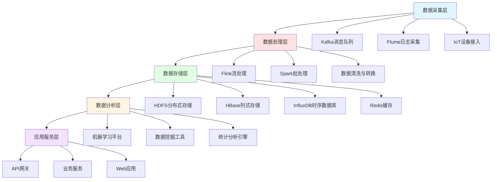

**机器学习框架**：
- **深度学习**：TensorFlow、PyTorch、Keras
- **传统机器学习**：Scikit-learn、XGBoost、LightGBM
- **模型部署**：TensorFlow Serving、ONNX Runtime、TorchServe

**开发工具与平台**：
- **容器化**：Docker、Kubernetes
- **持续集成/持续部署**：Jenkins、GitLab CI/CD
- **监控与日志**：Prometheus、Grafana、ELK Stack
- **版本控制**：Git、GitLab/GitHub

#### 3.1.3 算法可行性

**数据驱动的预测算法已在气象领域得到验证**：

1. **时间序列预测**：
   - LSTM网络已成功应用于温度、湿度等连续变量预测
   - Seq2Seq模型在降水量预测中表现出色
   - 注意力机制（Attention）提升了长期依赖建模能力

2. **图像识别与外推**：
   - CNN在云图分类、雷达回波识别中准确率超过90%
   - U-Net架构实现了高质量的雷达回波外推
   - GAN生成的临近预报图像质量接近实际观测

3. **集成学习**：
   - 随机森林在极端天气识别中F1分数达到0.85以上
   - XGBoost在降水概率预报中超越了传统统计方法

**学术研究提供理论支撑**：
- 国内外已发表大量关于人工智能气象预报的高水平论文
- 国际气象组织（WMO）鼓励将机器学习技术应用于业务预报
- 多个国家气象局已建立AI预报系统并投入业务化运行

### 3.2 经济可行性

#### 3.2.1 成本估算

**开发阶段成本**（按18个月周期估算）：

| 项目 | 数量/规模 | 单价 | 小计（万元） | 说明 |
|------|----------|------|-------------|------|
| **人力成本** | | | **210** | |
| 项目经理 | 1人×18月 | 2.5万/月 | 45 | 全职 |
| 架构师 | 1人×12月 | 3万/月 | 36 | 前期设计阶段 |
| 算法工程师 | 2人×18月 | 2万/月 | 72 | 全职 |
| 开发工程师 | 3人×15月 | 1.5万/月 | 67.5 | 核心开发阶段 |
| 测试工程师 | 1人×6月 | 1.2万/月 | 7.2 | 测试阶段 |
| UI/UX设计师 | 1人×6月 | 1.5万/月 | 9 | 前期设计 |
| **硬件与平台** | | | **120** | |
| 云服务器 | 18月 | 3万/月 | 54 | 弹性计算资源 |
| GPU实例 | 12月 | 2万/月 | 24 | 模型训练 |
| 存储费用 | 18月 | 1.5万/月 | 27 | 100TB级存储 |
| 网络带宽 | 18月 | 0.8万/月 | 14.4 | 高带宽接入 |
| **软件与数据** | | | **50** | |
| 气象数据采购 | 一次性 | 20万 | 20 | 历史数据集 |
| 开发工具授权 | 年度 | 10万/年 | 15 | IDE、监控工具等 |
| 第三方API服务 | 18月 | 0.5万/月 | 9 | 地图、短信等 |
| 其他软件授权 | 一次性 | 6万 | 6 | 办公软件、协作工具 |
| **其他费用** | | | **20** | |
| 差旅与调研 | - | - | 8 | 用户调研、技术交流 |
| 培训费用 | - | - | 5 | 技术培训 |
| 办公场地 | 18月 | 0.3万/月 | 5.4 | 租金与物业 |
| 不可预见费用 | - | - | 1.6 | 预留费用 |
| **总计** | | | **400** | |

**运营阶段成本**（年度）：

| 项目 | 费用（万元/年） | 说明 |
|------|----------------|------|
| 服务器与存储 | 80 | 优化后降低30% |
| 运维人员 | 60 | 3人团队 |
| 数据更新 | 15 | 实时数据接入 |
| 系统维护与升级 | 20 | 版本迭代 |
| **合计** | **175** | |

#### 3.2.2 效益分析

**直接经济效益**：

1. **付费用户收入**（保守估计）：
   - **个人用户**：
     - 会员订阅：10元/月，预计3年内发展5万付费用户
     - 年收入：5万人 × 10元/月 × 12月 = 600万元
   
   - **企业用户**：
     - API调用服务：0.01元/次，预计日调用量100万次
     - 年收入：100万次/天 × 0.01元 × 365天 = 365万元
     - 行业定制服务：农业、物流、旅游等行业客户，预计20家，每家年服务费10万元
     - 年收入：20家 × 10万元 = 200万元
   
   - **广告收入**：
     - 预计日活跃用户50万，广告点击率2%，单次点击收益0.5元
     - 年收入：50万人 × 2% × 0.5元 × 365天 = 182.5万元
   
   - **三年累计收入预测**：
     - 第1年：300万元（起步期）
     - 第2年：800万元（成长期）
     - 第3年：1500万元（成熟期）
     - 合计：2600万元

2. **成本节约**：
   - 通过优化算法和资源调度，相比传统系统节约计算成本约30%
   - 三年节约成本：175万元/年 × 30% × 3年 = 157.5万元

**间接经济效益**：

1. **社会效益货币化评估**：
   - 根据研究，天气预报精度每提升1%，农业损失可减少约0.5%
   - 若覆盖区域农业年产值1000亿元，精度提升5%，损失减少：1000亿 × 5% × 0.5% = 2.5亿元
   - 交通、旅游等其他行业效益类似估算

2. **品牌价值与市场影响**：
   - 提升企业/机构在气象领域的技术影响力
   - 为后续项目合作和融资创造有利条件

#### 3.2.3 投资回报分析

**关键财务指标**：

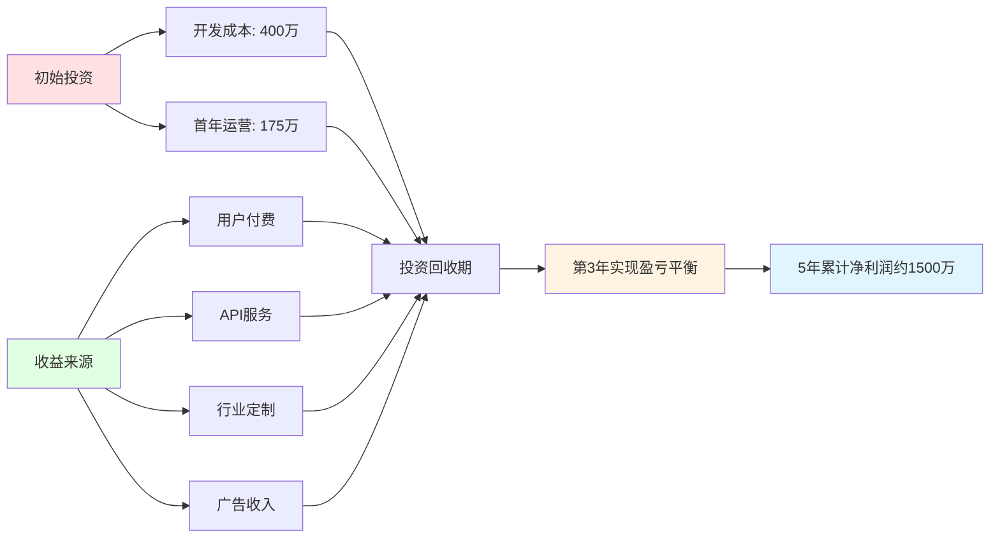

**盈亏平衡分析**：
- 总投资：575万元（开发400万 + 首年运营175万）
- 累计收入：
  - 第1年：300万
  - 第2年：800万（累计1100万）
  - 第3年：1500万（累计2600万）
- 累计运营成本（第2-3年）：175万 × 2 = 350万
- 净利润：2600万 - 575万 - 350万 = 1675万元

**投资回报率（ROI）**：
- 5年ROI = (累计净收益 / 总投资) × 100%
- ROI = 1675万 / 575万 × 100% ≈ 291%

**结论**：
从经济角度看，项目在第3年可实现盈亏平衡，5年投资回报率接近300%，具有良好的经济可行性。考虑到社会效益和品牌价值，项目的综合效益更加显著。

### 3.3 操作可行性

#### 3.3.1 团队能力

**技术团队构成**：

| 角色 | 人数 | 能力要求 | 当前状况 |
|------|------|----------|----------|
| 项目经理 | 1 | 5年以上项目管理经验，熟悉软件工程全流程 | 已配备，经验丰富 |
| 系统架构师 | 1 | 精通分布式系统、微服务架构，有大数据项目经验 | 已配备，主导过多个大型项目 |
| 算法工程师 | 2 | 硕士以上，熟悉机器学习算法，有气象或时序数据处理经验 | 需招聘1人，另1人已到位 |
| 后端开发 | 3 | 熟练掌握Java/Python，3年以上开发经验 | 2人到位，需招聘1人 |
| 前端开发 | 2 | 熟悉React/Vue，有数据可视化经验 | 1人到位，需招聘1人 |
| 测试工程师 | 1 | 熟悉自动化测试、性能测试 | 可内部调配 |
| 运维工程师 | 1 | 熟悉云平台运维、容器化部署 | 可内部调配 |

**培训计划**：
- 组织团队进行面向对象设计方法学培训（2周）
- 气象专业知识培训（1周）
- 机器学习平台使用培训（1周）
- 云平台操作培训（1周）

#### 3.3.2 用户接受度

**目标用户群体分析**：

1. **C端用户（公众）**：
   - **规模**：国内智能手机用户超10亿，天气类APP日活跃用户数千万
   - **需求**：准确的天气预报、及时的灾害预警、个性化推荐
   - **接受度**：高，用户已形成使用天气APP的习惯
   - **痛点**：当前APP预报不够准确，广告过多，个性化不足

2. **B端用户（企业/行业）**：
   - **农业**：种植大户、农业合作社需要精细化农业气象服务
   - **物流**：快递公司、货运企业需要路线天气预报
   - **旅游**：景区、旅行社需要旅游目的地天气预报
   - **建筑**：工地需要施工天气窗口预报
   - **接受度**：中高，行业用户愿意为专业服务付费

3. **G端用户（政府部门）**：
   - **应急管理**：需要灾害预警和应急决策支持
   - **交通管理**：需要道路天气状况实时监控
   - **环保部门**：需要大气污染气象条件预报
   - **接受度**：高，政府部门重视防灾减灾工作

**推广策略**：
- 与现有天气APP合作，提供API接口
- 开展试点应用，积累成功案例
- 参加气象行业会议，展示系统效果
- 利用社交媒体进行宣传推广

#### 3.3.3 实施风险与对策

**技术风险**：
- **风险**：算法效果未达预期、系统性能瓶颈
- **对策**：
  - 建立算法评估机制，多方案对比测试
  - 进行充分的性能测试和压力测试
  - 制定备用技术方案

**数据风险**：
- **风险**：数据质量问题、数据获取受限
- **对策**：
  - 建立严格的数据质量控制流程
  - 与权威气象数据提供商建立合作关系
  - 开发多源数据融合算法，降低对单一数据源的依赖

**进度风险**：
- **风险**：开发进度延期、关键人员离职
- **对策**：
  - 制定详细的项目计划和里程碑
  - 采用敏捷开发模式，分阶段交付
  - 建立知识共享机制，降低人员依赖

**市场风险**：
- **风险**：市场竞争激烈、用户增长不及预期
- **对策**：
  - 聚焦差异化特色功能
  - 建立用户反馈渠道，快速迭代优化
  - 多元化收入来源，降低单一收入模式风险

### 3.4 可行性研究结论

综合以上分析，本项目在技术、经济和操作三个方面均具有可行性：

**技术层面**：
- 硬件和网络条件成熟，云计算平台可满足计算和存储需求
- 软件技术栈完善，开源工具丰富
- 机器学习算法在气象领域已得到验证，技术路径清晰

**经济层面**：
- 初始投资适中，在可承受范围内
- 收入来源多元，市场潜力巨大
- 投资回报周期合理，长期效益显著

**操作层面**：
- 团队能力基本具备，缺口可通过招聘和培训弥补
- 目标用户需求明确，市场接受度高
- 风险可控，有明确的应对措施

**建议**：
项目可行，建议按计划启动。为确保成功，需要注意以下几点：
1. 尽快完成核心团队组建，特别是算法工程师的招聘
2. 优先开发核心功能，采用MVP（最小可行产品）策略快速验证
3. 与气象部门建立良好合作关系，确保数据来源稳定
4. 持续关注技术发展动态，及时引入新算法和新技术
5. 重视用户反馈，快速迭代产品功能

---

## 4. 需求分析

### 4.1 需求概述

天气预报系统优化设计项目旨在为不同类型用户提供高精度、个性化、实时的气象服务。通过深入的需求调研和分析，我们将系统需求分为功能需求和非功能需求两大类，确保系统设计能够全面满足用户期望和业务目标。

### 4.2 功能需求分析

#### 4.2.1 用户角色定义

系统涉及以下主要用户角色：

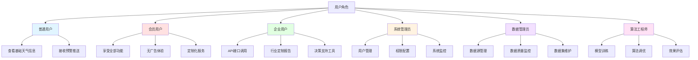

#### 4.2.2 核心功能需求

**1. 数据采集与管理模块**

**功能描述**：
实现多源气象数据的自动采集、标准化处理、质量控制和统一存储管理。

**具体需求**：

| 功能点 | 详细说明 | 优先级 |
|--------|----------|--------|
| 多源数据接入 | 支持地面观测站、卫星、雷达、数值模式等多种数据源接入 | 高 |
| 实时数据采集 | 以分钟级频率采集实时气象数据 | 高 |
| 数据标准化 | 将不同格式的数据转换为统一格式（如NetCDF、GeoJSON） | 高 |
| 数据质量控制 | 自动检测异常值、缺失值，进行标记和处理 | 高 |
| 历史数据管理 | 支持历史数据的存储、检索和归档 | 中 |
| 数据访问控制 | 根据用户角色设置数据访问权限 | 中 |

**用例示例**：
```
用例名称：采集地面观测站数据
主要参与者：数据采集子系统
前置条件：观测站设备正常运行，网络连接正常
基本流程：
1. 系统定时（每5分钟）向观测站发起数据请求
2. 接收观测站返回的气温、湿度、气压、风速风向等数据
3. 对接收数据进行完整性校验
4. 执行数据质量控制算法（范围检查、时间一致性检查等）
5. 将合格数据存入时序数据库
6. 对异常数据生成告警记录
后置条件：数据成功入库，可供后续分析使用
异常流程：若数据采集失败，记录日志并在5分钟后重试
```

**2. 预测算法引擎模块**

**功能描述**：
集成多种预测算法，提供短时临近预报、短期预报、中期预报和长期预报能力。

**具体需求**：

| 功能点 | 详细说明 | 优先级 |
|--------|----------|--------|
| 短时临近预报 | 0-2小时降水、雷暴等要素预报，更新频率≤10分钟 | 高 |
| 短期预报 | 未来24-72小时各气象要素预报，更新频率≤1小时 | 高 |
| 中期预报 | 未来3-7天预报，更新频率≤6小时 | 高 |
| 长期预报 | 未来7-15天趋势预报，日更新 | 中 |
| 多模型集成 | 支持LSTM、CNN、XGBoost等多种模型，并进行加权集成 | 高 |
| 误差订正 | 对数值模式输出进行统计误差订正 | 中 |
| 不确定性量化 | 提供预报置信区间和概率预报 | 中 |
| 在线学习 | 支持模型增量学习，持续优化预报效果 | 低 |

**算法技术要求**：
- 短时临近预报LSTM模型：时间步长10分钟，历史窗口6小时，预测未来2小时
- 卷积神经网络用于雷达回波外推：输入近30分钟雷达图像序列，输出未来1小时回波演变
- XGBoost用于降水概率预报：特征维度≥50，包含温度、湿度、风场等要素及其衍生特征

**3. 智能预警系统模块**

**功能描述**：
基于预测结果和预警规则，自动生成并发布气象灾害预警信息。

**具体需求**：

| 功能点 | 详细说明 | 优先级 |
|--------|----------|--------|
| 多灾种预警 | 支持暴雨、台风、高温、寒潮、大风等灾害预警 | 高 |
| 分级预警 | 按照气象灾害预警信号标准，划分蓝色、黄色、橙色、红色四级 | 高 |
| 阈值配置 | 管理员可自定义不同地区、不同灾种的预警阈值 | 中 |
| 智能推送 | 根据用户位置和订阅偏好，精准推送预警信息 | 高 |
| 多渠道发布 | 支持APP推送、短信、邮件、语音电话等多种发布渠道 | 中 |
| 预警评估 | 记录预警发布情况，统计准确率、空报率、漏报率 | 低 |

**预警规则示例**：
```
暴雨预警规则：
- 蓝色预警：12小时内降雨量将达50毫米以上，或已达50毫米且可能持续
- 黄色预警：6小时内降雨量将达50毫米以上，或已达50毫米且可能持续
- 橙色预警：3小时内降雨量将达50毫米以上，或已达50毫米且可能持续
- 红色预警：3小时内降雨量将达100毫米以上，或已达100毫米且可能持续
```

**4. 数据可视化与展示模块**

**功能描述**：
通过直观的图表、地图和动画，向用户展示天气信息和预报结果。

**具体需求**：

| 功能点 | 详细说明 | 优先级 |
|--------|----------|--------|
| 实况展示 | 展示当前温度、湿度、风速等实时观测数据 | 高 |
| 预报展示 | 以时间轴形式展示未来7-15天天气预报 | 高 |
| 地图可视化 | 在地图上叠加温度场、降水分布、云图等要素 | 高 |
| 雷达回波图 | 实时更新雷达回波动画，支持回放功能 | 中 |
| 卫星云图 | 提供可见光、红外云图，支持时间序列播放 | 中 |
| 趋势图表 | 温度、降水等要素的时间变化曲线图 | 高 |
| 数据对比 | 支持不同地点、不同时间段的数据对比 | 低 |
| 自定义图层 | 用户可自定义显示哪些气象要素图层 | 低 |

**可视化技术要求**：
- 地图底图支持在线/离线切换
- 气象要素图层支持透明度调节
- 动画播放帧率≥10fps，确保流畅度
- 响应式设计，适配PC、平板、手机多种屏幕

**5. 用户服务模块**

**功能描述**：
提供用户注册登录、个性化设置、订阅管理等服务功能。

**具体需求**：

| 功能点 | 详细说明 | 优先级 |
|--------|----------|--------|
| 用户注册登录 | 支持手机号、邮箱注册，第三方登录（微信、支付宝等） | 高 |
| 个人中心 | 用户信息管理、密码修改、账号注销 | 高 |
| 位置管理 | 添加常用位置（如家、公司），自动定位功能 | 高 |
| 订阅设置 | 设置关注的天气要素、预警类型、推送时间 | 中 |
| 会员服务 | 会员购买、续费、权益展示 | 中 |
| 消息中心 | 接收系统通知、预警信息、活动推送 | 中 |
| 用户反馈 | 提交bug反馈、功能建议、使用问题 | 低 |

**6. API服务模块**

**功能描述**：
为企业用户和第三方开发者提供RESTful API接口，支持数据查询和预测服务。

**具体需求**：

| 功能点 | 详细说明 | 优先级 |
|--------|----------|--------|
| 实况数据API | 获取指定位置的实时气象观测数据 | 高 |
| 预报数据API | 获取指定位置的未来天气预报数据 | 高 |
| 历史数据API | 查询历史气象数据 | 中 |
| 预警信息API | 获取当前有效的气象预警信息 | 高 |
| 图像服务API | 获取雷达图、云图等气象图像 | 中 |
| 批量查询API | 支持多地点批量查询，提高效率 | 中 |
| 访问认证 | 基于Token的身份认证机制 | 高 |
| 调用限流 | 根据用户级别设置API调用频率限制 | 高 |

**API接口示例**：
```http
GET /api/v1/weather/forecast
Parameters:
  - location: 经纬度或城市名称
  - hours: 预报时长（1-168小时）
  - elements: 需要的气象要素（temperature,humidity,wind等）
  
Response:
{
  "code": 200,
  "message": "success",
  "data": {
    "location": {"lon": 116.4, "lat": 39.9, "name": "北京"},
    "update_time": "2025-12-19T10:00:00Z",
    "forecast": [
      {
        "time": "2025-12-19T11:00:00Z",
        "temperature": 5.2,
        "humidity": 45,
        "wind_speed": 3.5,
        "wind_direction": 315,
        "weather": "晴"
      },
      ...
    ]
  }
}
```

**7. 系统管理模块**

**功能描述**：
为系统管理员提供用户管理、权限配置、系统监控等后台管理功能。

**具体需求**：

| 功能点 | 详细说明 | 优先级 |
|--------|----------|--------|
| 用户管理 | 查看用户列表、用户详情、封禁/解封用户 | 高 |
| 角色权限管理 | 定义不同角色，分配功能权限 | 高 |
| 数据源管理 | 配置数据源连接参数、启停数据采集任务 | 高 |
| 算法模型管理 | 上传新模型、切换模型版本、查看模型效果 | 高 |
| 系统监控 | 实时监控系统运行状态、资源使用情况 | 高 |
| 日志管理 | 查看系统日志、操作日志、异常日志 | 中 |
| 统计分析 | 用户访问统计、API调用统计、预警发布统计 | 中 |
| 配置管理 | 系统参数配置、预警阈值配置 | 中 |

#### 4.2.3 业务流程分析

**天气预报生成流程**：

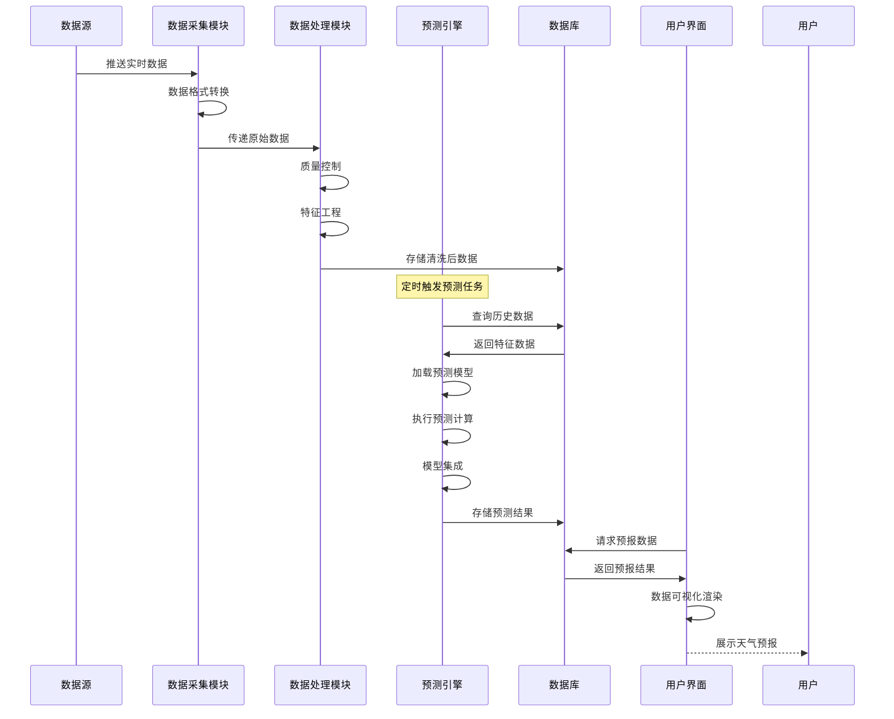

**预警发布流程**：

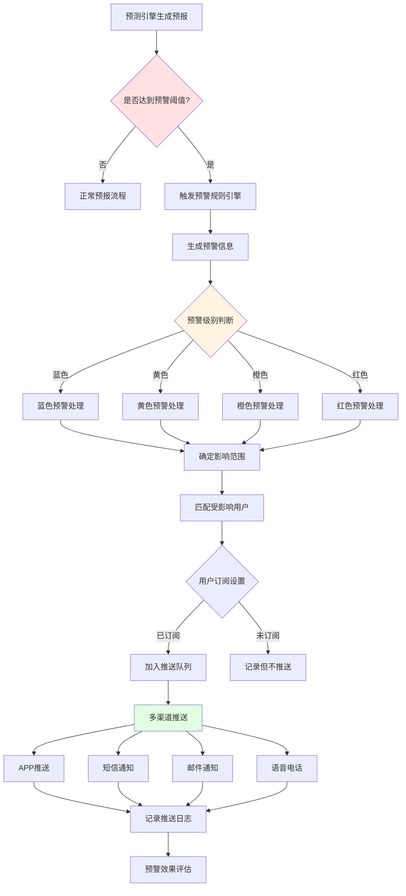

### 4.3 非功能需求分析

#### 4.3.1 性能需求

**响应时间要求**：

| 操作类型 | 响应时间要求 | 说明 |
|----------|-------------|------|
| 页面加载 | ≤2秒 | 首屏加载时间 |
| 数据查询 | ≤1秒 | 单次数据查询 |
| 地图渲染 | ≤3秒 | 包含气象要素图层 |
| API调用 | ≤500毫秒 | 99%请求响应时间 |
| 预测计算 | ≤5分钟 | 短期预报生成时间 |

**并发处理能力**：

| 指标 | 要求 | 备注 |
|------|------|------|
| 并发用户数 | ≥10,000 | 峰值时段 |
| API QPS | ≥5,000 | 每秒查询数 |
| 消息推送 | ≥1,000/秒 | 预警推送速率 |
| 数据写入 | ≥10,000条/秒 | 时序数据库 |

**数据处理能力**：

| 数据类型 | 处理能力 | 说明 |
|----------|---------|------|
| 实时观测数据 | 10万条/分钟 | 全国观测站数据 |
| 卫星数据 | 1GB/小时 | 多颗卫星数据 |
| 雷达数据 | 500MB/小时 | 区域雷达网数据 |
| 模式数据 | 10GB/天 | 数值预报模式输出 |

#### 4.3.2 可靠性需求

**系统可用性**：
- 系统年可用性≥99.5%（允许年停机时间≤43.8小时）
- 核心服务可用性≥99.9%
- 计划内维护窗口：每月第一个周日凌晨2:00-6:00

**数据可靠性**：
- 数据持久化保证，关键数据多副本存储（≥3副本）
- 每日自动备份，备份数据保留≥90天
- 数据恢复时间目标（RTO）≤4小时
- 数据恢复点目标（RPO）≤1小时

**容错能力**：
- 支持单点故障自动切换
- 关键组件冗余部署
- 数据采集失败自动重试机制（最多3次）
- 预测任务失败降级策略（使用历史统计数据）

#### 4.3.3 安全性需求

**数据安全**：
- 敏感数据加密存储（AES-256）
- 数据传输加密（TLS 1.2+）
- 数据脱敏：日志中不记录用户手机号、邮箱等敏感信息
- 定期安全审计和渗透测试

**访问控制**：
- 基于RBAC（Role-Based Access Control）的权限管理
- API访问需要Token认证
- 支持IP白名单/黑名单
- 登录失败5次账号临时锁定30分钟

**隐私保护**：
- 符合《个人信息保护法》要求
- 用户位置信息仅用于气象服务，不进行商业化利用
- 提供用户数据导出和删除功能
- 第三方数据共享需用户明确授权

#### 4.3.4 可维护性需求

**代码质量**：
- 代码注释率≥30%
- 单元测试覆盖率≥70%
- 核心模块测试覆盖率≥90%
- 遵循统一的编码规范（如PEP 8、Google Java Style）

**日志记录**：
- 所有API调用记录访问日志
- 异常和错误记录详细日志
- 关键业务操作记录审计日志
- 日志保留期≥6个月

**监控告警**：
- 实时监控CPU、内存、磁盘、网络等资源使用率
- 服务异常自动告警（邮件+短信）
- 性能指标超阈值告警
- 数据质量异常告警

**文档要求**：
- 系统架构文档
- API接口文档（Swagger格式）
- 数据库设计文档
- 运维手册和故障处理手册
- 用户使用手册

#### 4.3.5 可扩展性需求

**横向扩展**：
- 支持通过增加服务器节点提升处理能力
- 无状态服务设计，便于水平扩容
- 支持服务动态上下线，不影响运行中的请求

**功能扩展**：
- 预留接口支持新数据源接入
- 算法模块插件化，支持新模型快速集成
- 预警规则配置化，便于新增预警类型

**数据扩展**：
- 分库分表设计，支持数据量增长
- 冷热数据分离，优化存储成本
- 支持新增气象要素字段

#### 4.3.6 兼容性需求

**浏览器兼容**：
- Chrome（最近2个版本）
- Firefox（最近2个版本）
- Safari（最近2个版本）
- Edge（最近2个版本）

**移动端兼容**：
- iOS 12+
- Android 8.0+

**接口兼容**：
- API版本管理，新版本向后兼容至少2个版本
- 废弃接口提前3个月通知

**数据格式兼容**：
- 支持JSON、XML、CSV等多种数据格式
- 遵循WMO（世界气象组织）数据格式标准

### 4.4 需求优先级

根据MoSCoW方法，将需求分为四个优先级：

**Must Have（必须实现）**：
- 数据采集与存储
- 短时临近预报（0-2小时）
- 短期预报（24-72小时）
- 基本预警功能
- 实况与预报展示
- 用户注册登录
- API基本接口

**Should Have（应该实现）**：
- 中期预报（3-7天）
- 雷达回波外推
- 多模型集成
- 智能推送
- 会员服务
- 系统监控

**Could Have（可以实现）**：
- 长期预报（7-15天）
- 在线学习
- 预警评估
- 数据对比
- 用户反馈

**Won't Have（暂不实现）**：
- 全球范围预报（初期仅覆盖国内）
- 极端复杂的定制化服务
- 实时语音交互

### 4.5 需求验收标准

每个功能模块需要满足以下验收标准：

**功能完整性**：
- 所有需求规格说明书中定义的功能均已实现
- 功能演示通过用户验收测试（UAT）

**性能达标**：
- 通过性能测试，满足非功能需求中的性能指标
- 并发压力测试通过

**稳定性验证**：
- 连续运行7天无重大故障
- 错误率≤0.1%

**安全检查**：
- 通过安全扫描，无高危漏洞
- 完成渗透测试

**文档齐全**：
- 用户手册、API文档、运维文档完整
- 代码注释和技术文档符合要求

---

## 5. 系统分析与总体设计

### 5.1 面向对象分析

#### 5.1.1 问题域分析

天气预报系统的核心问题域包括气象数据的采集、处理、分析、预测和展示。通过面向对象的方法，我们将问题域中的实体抽象为对象，识别对象之间的关系和交互，构建符合客观世界的系统模型。

**核心实体识别**：

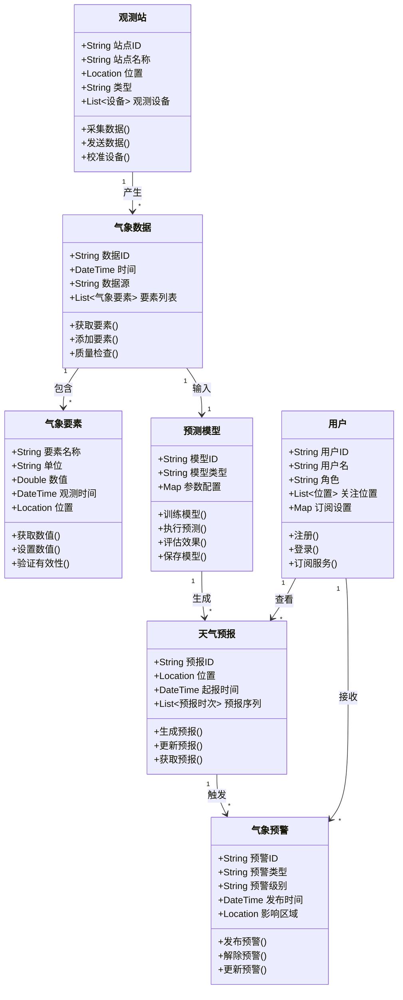

#### 5.1.2 对象模型

**类结构设计**：

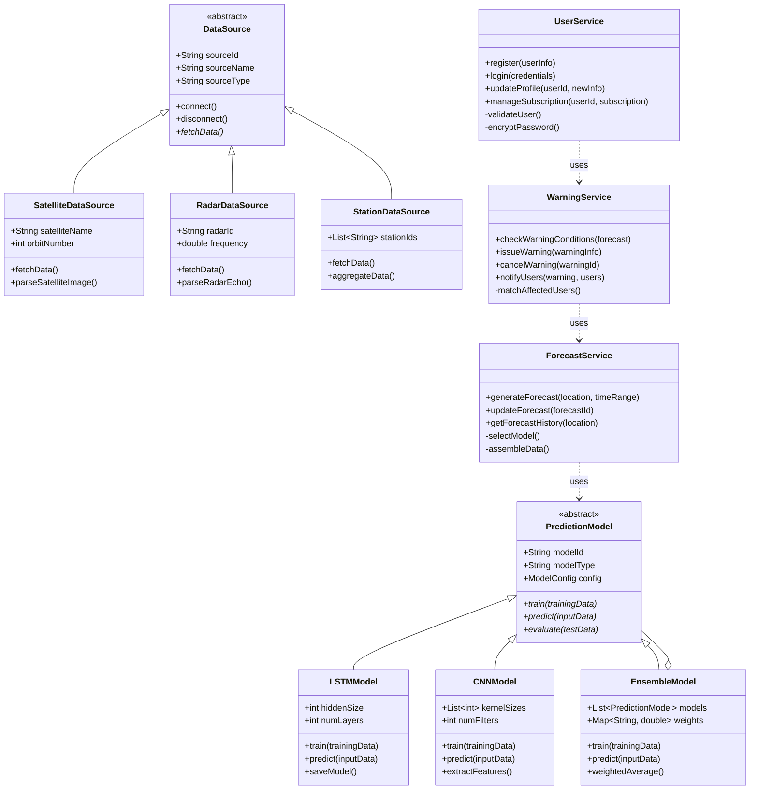

#### 5.1.3 动态模型

**状态图 - 预警生命周期**：

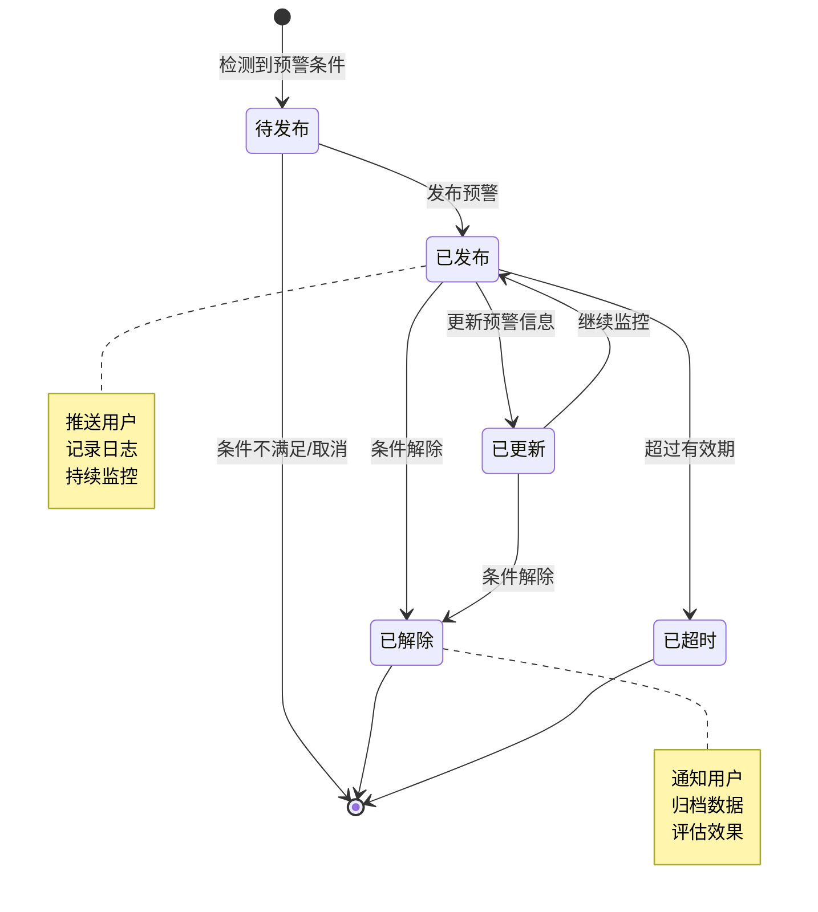

**活动图 - 预测流程**：

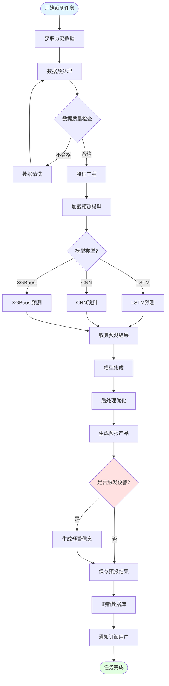

#### 5.1.4 功能模型

**数据流图（DFD）**：

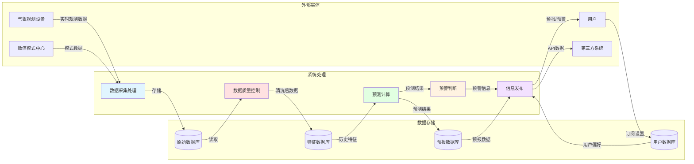

### 5.2 系统架构设计

#### 5.2.1 总体架构

采用**微服务架构 + 分层设计**的模式，系统分为六个层次：

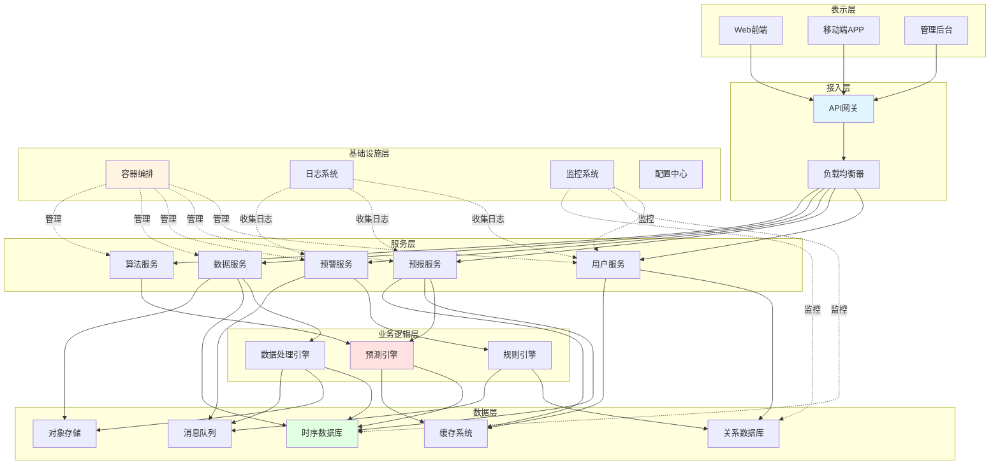

**架构说明**：

1. **表示层**：提供用户交互界面，包括Web端、移动端和管理后台
2. **接入层**：处理所有外部请求，提供负载均衡、路由、鉴权等功能
3. **服务层**：按业务领域划分的微服务，各服务独立部署、独立扩展
4. **业务逻辑层**：核心业务逻辑处理引擎，包括数据处理、预测计算、规则判断等
5. **数据层**：提供数据持久化和临时存储，采用多种数据库适应不同场景
6. **基础设施层**：提供容器化部署、监控告警、日志管理等基础能力

#### 5.2.2 技术架构

**技术栈选型**：

| 层次 | 技术选型 | 说明 |
|------|---------|------|
| **前端** | React + TypeScript + Ant Design | 现代化UI框架，组件丰富 |
| | ECharts + Leaflet | 数据可视化和地图展示 |
| **网关** | Kong / Nginx | API网关，支持限流、鉴权 |
| **后端** | Spring Boot(Java) | 用户服务、系统管理 |
| | Flask/FastAPI(Python) | 算法服务、数据服务 |
| **消息队列** | Apache Kafka | 高吞吐量消息中间件 |
| **流处理** | Apache Flink | 实时数据处理 |
| **批处理** | Apache Spark | 离线大数据处理 |
| **数据库** | PostgreSQL + PostGIS | 关系数据 + 空间数据 |
| | InfluxDB | 时序数据 |
| | Redis | 缓存 + 会话管理 |
| | MongoDB | 文档数据（日志、配置等） |
| **对象存储** | MinIO / S3 | 图像、文件存储 |
| **容器化** | Docker + Kubernetes | 容器编排和管理 |
| **监控** | Prometheus + Grafana | 指标监控和可视化 |
| | ELK Stack | 日志收集和分析 |
| **配置管理** | Consul / Nacos | 服务发现和配置中心 |

#### 5.2.3 微服务划分

**服务列表**：

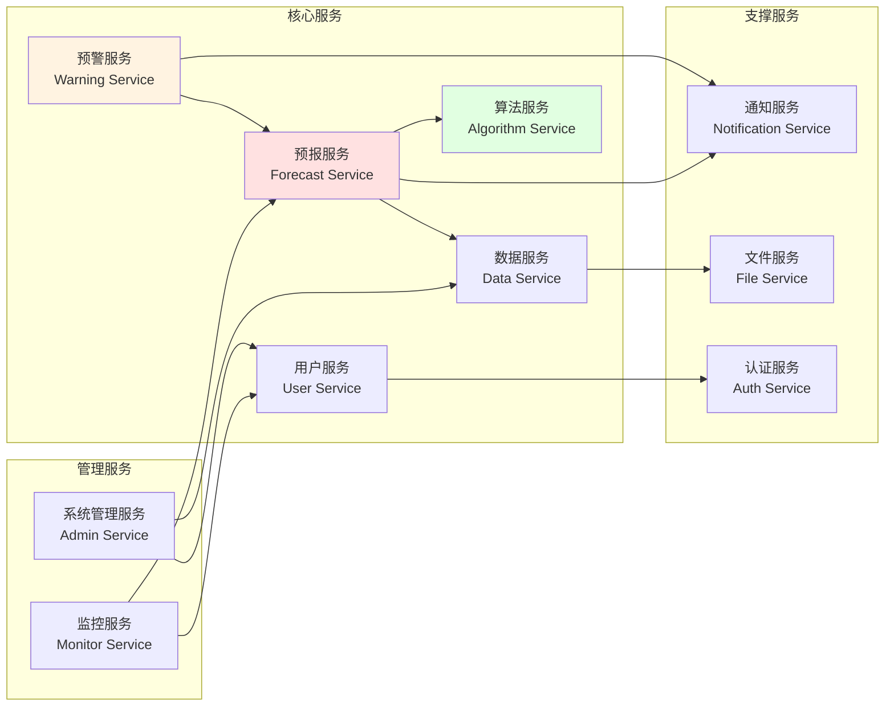

**服务职责说明**：

| 服务名称 | 职责 | 端口 | 数据库 |
|---------|------|------|--------|
| **用户服务** | 用户注册登录、个人信息管理、权限验证 | 8081 | PostgreSQL + Redis |
| **预报服务** | 预报生成、预报查询、预报更新 | 8082 | InfluxDB + Redis |
| **预警服务** | 预警判断、预警发布、预警管理 | 8083 | PostgreSQL + Kafka |
| **数据服务** | 数据采集、数据存储、数据查询 | 8084 | InfluxDB + MinIO |
| **算法服务** | 模型训练、预测计算、模型管理 | 8085 | PostgreSQL + Redis |
| **通知服务** | 消息推送、短信发送、邮件发送 | 8086 | MongoDB + Redis |
| **文件服务** | 文件上传、文件下载、图像处理 | 8087 | MinIO |
| **认证服务** | Token生成、Token验证、单点登录 | 8088 | Redis |
| **系统管理服务** | 用户管理、配置管理、日志查询 | 8089 | PostgreSQL + MongoDB |
| **监控服务** | 指标采集、健康检查、告警触发 | 8090 | Prometheus |

### 5.3 功能模块设计

#### 5.3.1 模块结构图

```mermaid
graph TB
    A[天气预报系统] --> B[数据管理模块]
    A --> C[预测引擎模块]
    A --> D[预警系统模块]
    A --> E[用户服务模块]
    A --> F[展示交互模块]
    A --> G[系统管理模块]
    
    B --> B1[数据采集子模块]
    B --> B2[数据清洗子模块]
    B --> B3[数据存储子模块]
    B --> B4[数据查询子模块]
    
    C --> C1[模型管理子模块]
    C --> C2[特征工程子模块]
    C --> C3[预测计算子模块]
    C --> C4[结果优化子模块]
    
    D --> D1[规则引擎子模块]
    D --> D2[预警生成子模块]
    D --> D3[预警发布子模块]
    D --> D4[效果评估子模块]
    
    E --> E1[认证授权子模块]
    E --> E2[个人中心子模块]
    E --> E3[订阅管理子模块]
    E --> E4[API接口子模块]
    
    F --> F1[实况展示子模块]
    F --> F2[预报展示子模块]
    F --> F3[地图可视化子模块]
    F --> F4[交互查询子模块]
    
    G --> G1[用户管理子模块]
    G --> G2[权限管理子模块]
    G --> G3[监控告警子模块]
    G --> G4[日志分析子模块]
    
    style A fill:#e1f5ff
    style B fill:#ffe1e1
    style C fill:#e1ffe1
    style D fill:#fff3e1
    style E fill:#f3e1ff
    style F fill:#ffe1f5
    style G fill:#f5ffe1
```

#### 5.3.2 模块间接口设计

**接口调用关系**：

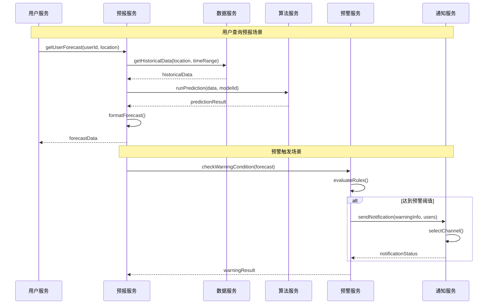

**关键接口定义示例**：

```java
// 预报服务接口
public interface ForecastService {
    /**
     * 生成天气预报
     * @param location 位置信息（经纬度或城市名称）
     * @param hours 预报时长（小时）
     * @param elements 需要的气象要素列表
     * @return 预报结果
     */
    ForecastResult generateForecast(Location location, int hours, List<String> elements);
    
    /**
     * 获取历史预报
     * @param location 位置信息
     * @param startTime 开始时间
     * @param endTime 结束时间
     * @return 历史预报列表
     */
    List<ForecastResult> getForecastHistory(Location location, DateTime startTime, DateTime endTime);
}

// 算法服务接口
public interface AlgorithmService {
    /**
     * 执行预测
     * @param inputData 输入数据（特征矩阵）
     * @param modelId 模型ID
     * @return 预测结果
     */
    PredictionResult predict(Matrix inputData, String modelId);
    
    /**
     * 训练模型
     * @param trainingData 训练数据
     * @param config 模型配置
     * @return 训练好的模型ID
     */
    String trainModel(TrainingDataset trainingData, ModelConfig config);
    
    /**
     * 评估模型
     * @param modelId 模型ID
     * @param testData 测试数据
     * @return 评估指标（RMSE、MAE等）
     */
    Map<String, Double> evaluateModel(String modelId, TestDataset testData);
}
```

### 5.4 数据库设计

#### 5.4.1 数据库选型策略

**多数据库混合使用**：

| 数据类型 | 数据库 | 使用场景 | 数据量级 |
|---------|-------|---------|---------|
| 时序数据 | InfluxDB | 观测数据、预报数据 | TB级 |
| 关系数据 | PostgreSQL | 用户信息、配置信息、预警记录 | GB级 |
| 空间数据 | PostGIS | 站点位置、预警区域 | GB级 |
| 缓存数据 | Redis | 会话、热点数据 | GB级 |
| 文档数据 | MongoDB | 日志、非结构化配置 | TB级 |
| 图像文件 | MinIO | 雷达图、云图 | PB级 |

#### 5.4.2 核心数据表设计

**PostgreSQL表结构（关系数据）**：

```sql
-- 用户表
CREATE TABLE users (
    user_id VARCHAR(32) PRIMARY KEY,
    username VARCHAR(50) NOT NULL UNIQUE,
    password_hash VARCHAR(128) NOT NULL,
    email VARCHAR(100),
    phone VARCHAR(20),
    role VARCHAR(20) DEFAULT 'user', -- user, vip, enterprise, admin
    status VARCHAR(20) DEFAULT 'active', -- active, banned, deleted
    created_at TIMESTAMP DEFAULT CURRENT_TIMESTAMP,
    updated_at TIMESTAMP DEFAULT CURRENT_TIMESTAMP,
    INDEX idx_username (username),
    INDEX idx_email (email)
);

-- 用户订阅设置表
CREATE TABLE user_subscriptions (
    subscription_id VARCHAR(32) PRIMARY KEY,
    user_id VARCHAR(32) NOT NULL,
    location_name VARCHAR(100),
    latitude DECIMAL(10, 7),
    longitude DECIMAL(10, 7),
    subscribed_elements JSON, -- ["temperature", "precipitation", "wind"]
    warning_types JSON, -- ["rainstorm", "typhoon", "heatwave"]
    push_time TIME, -- 推送时间
    is_active BOOLEAN DEFAULT TRUE,
    created_at TIMESTAMP DEFAULT CURRENT_TIMESTAMP,
    FOREIGN KEY (user_id) REFERENCES users(user_id),
    INDEX idx_user (user_id),
    INDEX idx_location (latitude, longitude)
);

-- 预警记录表
CREATE TABLE warning_records (
    warning_id VARCHAR(32) PRIMARY KEY,
    warning_type VARCHAR(50) NOT NULL, -- rainstorm, typhoon, heatwave等
    warning_level VARCHAR(20) NOT NULL, -- blue, yellow, orange, red
    affected_region GEOMETRY(POLYGON, 4326), -- 使用PostGIS存储多边形区域
    start_time TIMESTAMP NOT NULL,
    end_time TIMESTAMP,
    status VARCHAR(20) DEFAULT 'active', -- active, cancelled, expired
    issued_by VARCHAR(50),
    description TEXT,
    created_at TIMESTAMP DEFAULT CURRENT_TIMESTAMP,
    updated_at TIMESTAMP DEFAULT CURRENT_TIMESTAMP,
    INDEX idx_type (warning_type),
    INDEX idx_time (start_time, end_time),
    SPATIAL INDEX idx_region (affected_region)
);

-- 模型管理表
CREATE TABLE prediction_models (
    model_id VARCHAR(32) PRIMARY KEY,
    model_name VARCHAR(100) NOT NULL,
    model_type VARCHAR(50) NOT NULL, -- LSTM, CNN, XGBoost, Ensemble
    model_version VARCHAR(20),
    model_path VARCHAR(255), -- 模型文件存储路径
    hyperparameters JSON,
    training_dataset VARCHAR(100),
    accuracy_metrics JSON, -- {"RMSE": 2.5, "MAE": 1.8, "R2": 0.92}
    status VARCHAR(20) DEFAULT 'inactive', -- active, inactive, training
    created_by VARCHAR(32),
    created_at TIMESTAMP DEFAULT CURRENT_TIMESTAMP,
    activated_at TIMESTAMP,
    INDEX idx_type (model_type),
    INDEX idx_status (status)
);

-- API调用日志表
CREATE TABLE api_call_logs (
    log_id BIGSERIAL PRIMARY KEY,
    user_id VARCHAR(32),
    api_endpoint VARCHAR(200),
    request_method VARCHAR(10),
    request_params TEXT,
    response_status INT,
    response_time_ms INT,
    ip_address VARCHAR(45),
    user_agent VARCHAR(255),
    created_at TIMESTAMP DEFAULT CURRENT_TIMESTAMP,
    INDEX idx_user (user_id),
    INDEX idx_endpoint (api_endpoint),
    INDEX idx_time (created_at)
);
```

**InfluxDB数据结构（时序数据）**：

```
-- Measurement: weather_observations (气象观测数据)
-- Tags（索引字段）:
--   station_id: 站点ID
--   province: 省份
--   city: 城市
-- Fields（数据字段）:
--   temperature: 温度（℃）
--   humidity: 相对湿度（%）
--   pressure: 气压（hPa）
--   wind_speed: 风速（m/s）
--   wind_direction: 风向（度）
--   precipitation: 降水量（mm）
-- Time: 观测时间

示例数据：
weather_observations,station_id=54511,province=北京,city=北京 temperature=5.2,humidity=45,pressure=1013.2,wind_speed=3.5,wind_direction=315,precipitation=0.0 1734599400000000000

-- Measurement: weather_forecasts (天气预报数据)
-- Tags:
--   forecast_id: 预报批次ID
--   location_id: 位置ID
--   model_id: 使用的模型ID
-- Fields:
--   temperature: 预报温度
--   precipitation_prob: 降水概率（%）
--   precipitation_amount: 降水量（mm）
--   wind_speed: 风速
--   confidence: 预报置信度
-- Time: 预报时次

示例数据：
weather_forecasts,forecast_id=f20251219_10,location_id=116.4_39.9,model_id=lstm_v2 temperature=6.5,precipitation_prob=20,precipitation_amount=0.5,wind_speed=4.0,confidence=0.85 1734603000000000000
```

#### 5.4.3 数据分区与索引策略

**InfluxDB时序数据分区**：
- 按时间分片：每个Shard存储7天数据
- 热数据保留30天（内存+SSD）
- 温数据保留1年（HDD）
- 冷数据归档至对象存储（压缩后）

**PostgreSQL表分区**：
```sql
-- 对API日志表按月分区
CREATE TABLE api_call_logs (
    log_id BIGSERIAL,
    ...
    created_at TIMESTAMP NOT NULL
) PARTITION BY RANGE (created_at);

CREATE TABLE api_call_logs_202512 PARTITION OF api_call_logs
    FOR VALUES FROM ('2025-12-01') TO ('2026-01-01');

CREATE TABLE api_call_logs_202601 PARTITION OF api_call_logs
    FOR VALUES FROM ('2026-01-01') TO ('2026-02-01');
-- 每月自动创建下个月的分区
```

**索引优化**：
- 为高频查询字段创建复合索引
- 对大表使用部分索引（Partial Index）
- 定期VACUUM和ANALYZE，更新统计信息
- 使用EXPLAIN分析慢查询

### 5.5 关键技术点

#### 5.5.1 实时数据处理

**技术方案**：Kafka + Flink

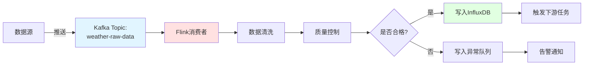

**Flink流处理代码框架**：
```python
from pyflink.datastream import StreamExecutionEnvironment
from pyflink.datastream.connectors import FlinkKafkaConsumer
from pyflink.common.serialization import SimpleStringSchema

def process_weather_data():
    env = StreamExecutionEnvironment.get_execution_environment()
    env.set_parallelism(4)
    
    # Kafka消费者配置
    kafka_consumer = FlinkKafkaConsumer(
        topics='weather-raw-data',
        deserialization_schema=SimpleStringSchema(),
        properties={'bootstrap.servers': 'localhost:9092', 'group.id': 'weather-processor'}
    )
    
    # 数据流处理
    data_stream = env.add_source(kafka_consumer) \
        .map(lambda x: parse_json(x)) \
        .filter(lambda x: quality_check(x)) \
        .map(lambda x: transform_data(x)) \
        .add_sink(influxdb_sink)
    
    env.execute("Weather Data Real-time Processing")
```

#### 5.5.2 分布式缓存策略

**多级缓存架构**：

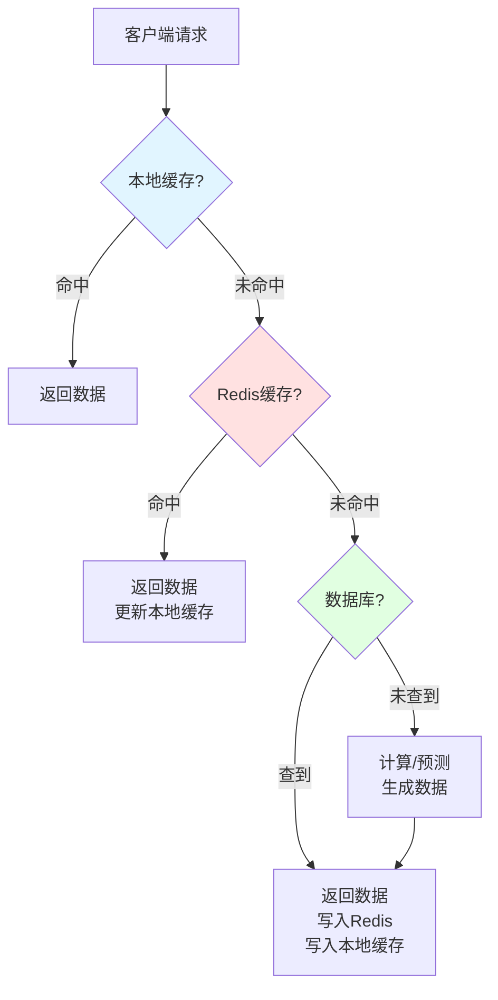

**缓存策略**：
- 预报数据缓存：TTL=1小时（预报更新频率）
- 实况数据缓存：TTL=5分钟（观测更新频率）
- 用户信息缓存：TTL=30分钟
- 静态配置缓存：TTL=1天

#### 5.5.3 负载均衡与容错

**负载均衡策略**：
- API网关层：轮询（Round Robin）+ 健康检查
- 服务间调用：最少活跃连接（Least Connections）
- 数据库连接：连接池 + 读写分离

**容错机制**：
- 服务熔断：连续失败3次触发熔断，5分钟后半开尝试恢复
- 服务降级：预测服务不可用时，返回历史统计平均值
- 限流保护：基于Token Bucket算法，防止流量突增

**高可用部署**：
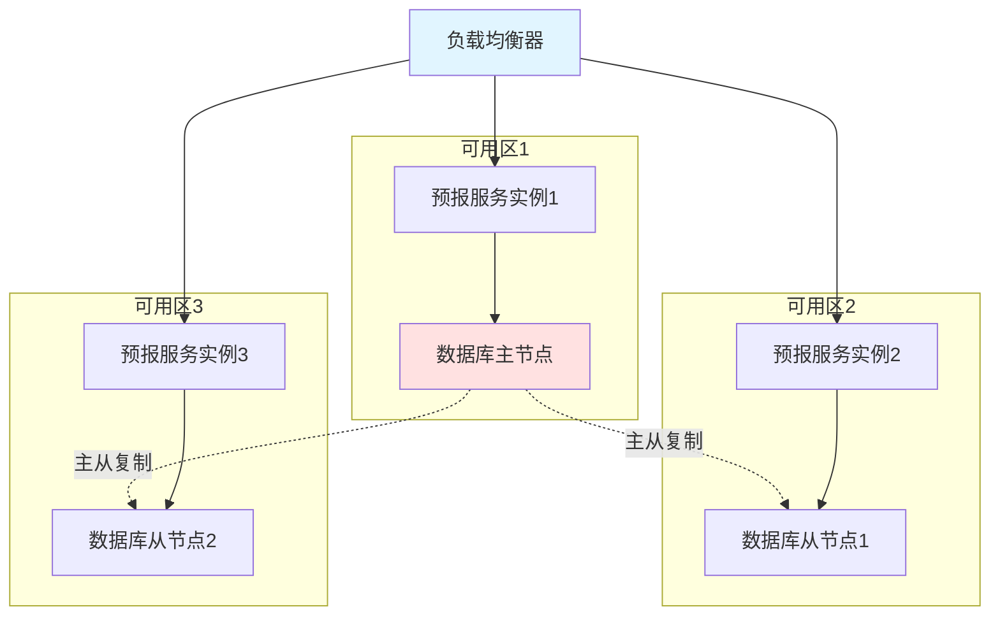

---

## 6. 详细设计

### 6.1 数据管理模块详细设计

#### 6.1.1 数据采集子模块

**设计思路**：
数据采集子模块采用**生产者-消费者模式**，通过消息队列解耦数据源和处理逻辑，实现异步、高吞吐的数据采集。

**类设计**：

```python
from abc import ABC, abstractmethod
from typing import Dict, List
import logging

class DataCollector(ABC):
    """数据采集器抽象基类"""
    
    def __init__(self, source_id: str, config: Dict):
        self.source_id = source_id
        self.config = config
        self.logger = logging.getLogger(self.__class__.__name__)
        self._is_running = False
    
    @abstractmethod
    def connect(self) -> bool:
        """建立与数据源的连接"""
        pass
    
    @abstractmethod
    def collect_data(self) -> List[Dict]:
        """采集数据"""
        pass
    
    @abstractmethod
    def disconnect(self):
        """断开连接"""
        pass
    
    def validate_data(self, data: Dict) -> bool:
        """数据有效性验证"""
        required_fields = ['timestamp', 'location', 'elements']
        return all(field in data for field in required_fields)
    
    def publish_to_queue(self, data: List[Dict]):
        """发布数据到消息队列"""
        from kafka import KafkaProducer
        import json
        
        producer = KafkaProducer(
            bootstrap_servers=self.config.get('kafka_servers'),
            value_serializer=lambda v: json.dumps(v).encode('utf-8')
        )
        
        for item in data:
            if self.validate_data(item):
                producer.send('weather-raw-data', value=item)
                self.logger.info(f"Published data: {item['location']} at {item['timestamp']}")
            else:
                self.logger.warning(f"Invalid data skipped: {item}")
        
        producer.flush()
        producer.close()


class StationDataCollector(DataCollector):
    """地面观测站数据采集器"""
    
    def connect(self) -> bool:
        """连接观测站API"""
        import requests
        try:
            response = requests.get(
                f"{self.config['api_url']}/health",
                timeout=5
            )
            self._is_running = response.status_code == 200
            self.logger.info(f"Connected to station API: {self.config['api_url']}")
            return self._is_running
        except Exception as e:
            self.logger.error(f"Connection failed: {e}")
            return False
    
    def collect_data(self) -> List[Dict]:
        """采集地面观测数据"""
        import requests
        from datetime import datetime
        
        station_ids = self.config.get('station_ids', [])
        collected_data = []
        
        for station_id in station_ids:
            try:
                response = requests.get(
                    f"{self.config['api_url']}/stations/{station_id}/latest",
                    timeout=10
                )
                
                if response.status_code == 200:
                    raw_data = response.json()
                    
                    # 数据格式转换
                    formatted_data = {
                        'timestamp': datetime.fromisoformat(raw_data['obs_time']),
                        'source': f'station_{station_id}',
                        'location': {
                            'station_id': station_id,
                            'latitude': raw_data['lat'],
                            'longitude': raw_data['lon'],
                            'name': raw_data.get('name', '')
                        },
                        'elements': {
                            'temperature': raw_data.get('temp'),
                            'humidity': raw_data.get('rh'),
                            'pressure': raw_data.get('pres'),
                            'wind_speed': raw_data.get('wind_speed'),
                            'wind_direction': raw_data.get('wind_dir'),
                            'precipitation': raw_data.get('precip', 0.0)
                        }
                    }
                    
                    collected_data.append(formatted_data)
                    self.logger.debug(f"Collected data from station {station_id}")
                
            except Exception as e:
                self.logger.error(f"Failed to collect data from station {station_id}: {e}")
        
        return collected_data
    
    def disconnect(self):
        """断开连接"""
        self._is_running = False
        self.logger.info("Disconnected from station API")


class SatelliteDataCollector(DataCollector):
    """卫星数据采集器"""
    
    def connect(self) -> bool:
        """连接卫星数据服务"""
        # 实现卫星数据源连接逻辑
        self.logger.info("Connected to satellite data service")
        return True
    
    def collect_data(self) -> List[Dict]:
        """采集卫星数据"""
        # 实现卫星数据采集逻辑
        # 通常包括云图、辐射数据等
        pass
    
    def disconnect(self):
        """断开连接"""
        self.logger.info("Disconnected from satellite data service")
```

**调度器设计**：

```python
import schedule
import time
from typing import List

class DataCollectionScheduler:
    """数据采集调度器"""
    
    def __init__(self):
        self.collectors: List[DataCollector] = []
        self.logger = logging.getLogger(self.__class__.__name__)
    
    def register_collector(self, collector: DataCollector):
        """注册数据采集器"""
        self.collectors.append(collector)
        self.logger.info(f"Registered collector: {collector.__class__.__name__}")
    
    def run_collection_task(self, collector: DataCollector):
        """执行单个采集任务"""
        try:
            if collector.connect():
                data = collector.collect_data()
                if data:
                    collector.publish_to_queue(data)
                    self.logger.info(f"Collected {len(data)} records from {collector.source_id}")
                collector.disconnect()
        except Exception as e:
            self.logger.error(f"Collection task failed for {collector.source_id}: {e}")
    
    def start(self):
        """启动调度器"""
        # 地面观测站：每5分钟采集一次
        for collector in self.collectors:
            if isinstance(collector, StationDataCollector):
                schedule.every(5).minutes.do(self.run_collection_task, collector=collector)
            elif isinstance(collector, SatelliteDataCollector):
                # 卫星数据：每15分钟采集一次
                schedule.every(15).minutes.do(self.run_collection_task, collector=collector)
        
        self.logger.info("Data collection scheduler started")
        
        while True:
            schedule.run_pending()
            time.sleep(1)
```

#### 6.1.2 数据质量控制子模块

**设计思路**：
实现多种质量控制算法，包括范围检查、时间一致性检查、空间一致性检查等，确保数据质量。

**关键算法**：

```python
import numpy as np
from typing import Dict, Tuple, List
from datetime import datetime, timedelta

class DataQualityController:
    """数据质量控制器"""
    
    def __init__(self, config: Dict):
        self.config = config
        self.logger = logging.getLogger(self.__class__.__name__)
        
        # 气象要素合理范围
        self.valid_ranges = {
            'temperature': (-60, 60),      # 温度范围：-60℃ ~ 60℃
            'humidity': (0, 100),          # 湿度范围：0% ~ 100%
            'pressure': (850, 1100),       # 气压范围：850hPa ~ 1100hPa
            'wind_speed': (0, 75),         # 风速范围：0m/s ~ 75m/s
            'wind_direction': (0, 360),    # 风向范围：0° ~ 360°
            'precipitation': (0, 500)      # 降水范围：0mm ~ 500mm(单小时)
        }
    
    def range_check(self, data: Dict) -> Tuple[bool, List[str]]:
        """范围检查：检查数据是否在合理范围内"""
        passed = True
        errors = []
        
        elements = data.get('elements', {})
        for element, value in elements.items():
            if element in self.valid_ranges:
                min_val, max_val = self.valid_ranges[element]
                if value is not None and not (min_val <= value <= max_val):
                    passed = False
                    errors.append(f"{element} value {value} out of range [{min_val}, {max_val}]")
        
        return passed, errors
    
    def temporal_consistency_check(self, data: Dict, historical_data: List[Dict]) -> Tuple[bool, List[str]]:
        """时间一致性检查：检查数据变化是否合理"""
        passed = True
        errors = []
        
        if not historical_data:
            return passed, errors
        
        # 取最近一次观测数据
        last_data = historical_data[-1]
        time_diff = (data['timestamp'] - last_data['timestamp']).total_seconds() / 3600  # 小时
        
        # 温度变化率检查（每小时不超过5℃）
        if 'temperature' in data['elements'] and 'temperature' in last_data['elements']:
            temp_change = abs(data['elements']['temperature'] - last_data['elements']['temperature'])
            max_change = 5 * time_diff
            
            if temp_change > max_change:
                passed = False
                errors.append(f"Temperature change {temp_change:.1f}℃ exceeds limit {max_change:.1f}℃")
        
        # 气压变化率检查（每小时不超过3hPa）
        if 'pressure' in data['elements'] and 'pressure' in last_data['elements']:
            pres_change = abs(data['elements']['pressure'] - last_data['elements']['pressure'])
            max_change = 3 * time_diff
            
            if pres_change > max_change:
                passed = False
                errors.append(f"Pressure change {pres_change:.1f}hPa exceeds limit {max_change:.1f}hPa")
        
        return passed, errors
    
    def spatial_consistency_check(self, data: Dict, nearby_stations_data: List[Dict]) -> Tuple[bool, List[str]]:
        """空间一致性检查：与周边站点数据对比"""
        passed = True
        errors = []
        
        if len(nearby_stations_data) < 3:
            # 周边站点数据不足，跳过检查
            return passed, errors
        
        # 检查温度是否与周边站点偏差过大
        if 'temperature' in data['elements']:
            nearby_temps = [
                d['elements']['temperature'] 
                for d in nearby_stations_data 
                if 'temperature' in d['elements'] and d['elements']['temperature'] is not None
            ]
            
            if nearby_temps:
                mean_temp = np.mean(nearby_temps)
                std_temp = np.std(nearby_temps)
                current_temp = data['elements']['temperature']
                
                # 偏差超过3个标准差，标记为异常
                if abs(current_temp - mean_temp) > 3 * std_temp:
                    passed = False
                    errors.append(f"Temperature {current_temp}℃ deviates significantly from nearby stations (mean={mean_temp:.1f}℃)")
        
        return passed, errors
    
    def missing_value_check(self, data: Dict) -> Tuple[bool, List[str]]:
        """缺失值检查"""
        passed = True
        errors = []
        
        required_elements = self.config.get('required_elements', ['temperature', 'humidity', 'pressure'])
        elements = data.get('elements', {})
        
        for element in required_elements:
            if element not in elements or elements[element] is None:
                passed = False
                errors.append(f"Missing required element: {element}")
        
        return passed, errors
    
    def execute_qc(self, data: Dict, context: Dict = None) -> Dict:
        """执行完整的质量控制流程"""
        qc_result = {
            'data': data,
            'passed': True,
            'checks': {},
            'errors': []
        }
        
        # 1. 范围检查
        passed, errors = self.range_check(data)
        qc_result['checks']['range_check'] = {'passed': passed, 'errors': errors}
        if not passed:
            qc_result['passed'] = False
            qc_result['errors'].extend(errors)
        
        # 2. 缺失值检查
        passed, errors = self.missing_value_check(data)
        qc_result['checks']['missing_value_check'] = {'passed': passed, 'errors': errors}
        if not passed:
            qc_result['passed'] = False
            qc_result['errors'].extend(errors)
        
        # 3. 时间一致性检查（需要历史数据）
        if context and 'historical_data' in context:
            passed, errors = self.temporal_consistency_check(data, context['historical_data'])
            qc_result['checks']['temporal_check'] = {'passed': passed, 'errors': errors}
            if not passed:
                qc_result['passed'] = False
                qc_result['errors'].extend(errors)
        
        # 4. 空间一致性检查（需要周边站点数据）
        if context and 'nearby_stations_data' in context:
            passed, errors = self.spatial_consistency_check(data, context['nearby_stations_data'])
            qc_result['checks']['spatial_check'] = {'passed': passed, 'errors': errors}
            if not passed:
                qc_result['passed'] = False
                qc_result['errors'].extend(errors)
        
        return qc_result
```

**缺失值填补算法**：

```python
from sklearn.impute import KNNImputer
import pandas as pd

class MissingValueImputer:
    """缺失值填补器"""
    
    def __init__(self, method='knn', n_neighbors=5):
        self.method = method
        self.n_neighbors = n_neighbors
        self.imputer = None
    
    def fit_and_transform(self, dataframe: pd.DataFrame) -> pd.DataFrame:
        """训练并转换数据"""
        if self.method == 'knn':
            self.imputer = KNNImputer(n_neighbors=self.n_neighbors)
            imputed_data = self.imputer.fit_transform(dataframe)
            return pd.DataFrame(imputed_data, columns=dataframe.columns, index=dataframe.index)
        
        elif self.method == 'interpolation':
            # 时间序列线性插值
            return dataframe.interpolate(method='linear', limit_direction='both')
        
        elif self.method == 'mean':
            # 均值填补
            return dataframe.fillna(dataframe.mean())
        
        else:
            raise ValueError(f"Unknown imputation method: {self.method}")
```

### 6.2 预测引擎模块详细设计

#### 6.2.1 LSTM预测模型实现

**模型架构**：

```python
import torch
import torch.nn as nn
import numpy as np
from typing import Tuple

class WeatherLSTM(nn.Module):
    """基于LSTM的天气预报模型"""
    
    def __init__(self, input_size: int, hidden_size: int, num_layers: int, output_size: int, dropout: float = 0.2):
        """
        Args:
            input_size: 输入特征维度（如温度、湿度、气压等）
            hidden_size: LSTM隐藏层维度
            num_layers: LSTM层数
            output_size: 输出维度（预测的气象要素数量）
            dropout: Dropout比率
        """
        super(WeatherLSTM, self).__init__()
        
        self.hidden_size = hidden_size
        self.num_layers = num_layers
        
        # LSTM层
        self.lstm = nn.LSTM(
            input_size=input_size,
            hidden_size=hidden_size,
            num_layers=num_layers,
            batch_first=True,
            dropout=dropout if num_layers > 1 else 0
        )
        
        # 全连接层
        self.fc = nn.Sequential(
            nn.Linear(hidden_size, hidden_size // 2),
            nn.ReLU(),
            nn.Dropout(dropout),
            nn.Linear(hidden_size // 2, output_size)
        )
    
    def forward(self, x: torch.Tensor) -> torch.Tensor:
        """
        Args:
            x: shape (batch_size, seq_length, input_size)
        Returns:
            output: shape (batch_size, output_size)
        """
        # LSTM前向传播
        lstm_out, (hidden, cell) = self.lstm(x)
        
        # 取最后一个时间步的输出
        last_output = lstm_out[:, -1, :]
        
        # 通过全连接层得到预测结果
        prediction = self.fc(last_output)
        
        return prediction


class LSTMTrainer:
    """LSTM模型训练器"""
    
    def __init__(self, model: WeatherLSTM, device: str = 'cuda' if torch.cuda.is_available() else 'cpu'):
        self.model = model.to(device)
        self.device = device
        self.criterion = nn.MSELoss()
        self.optimizer = torch.optim.Adam(model.parameters(), lr=0.001)
        self.scheduler = torch.optim.lr_scheduler.ReduceLROnPlateau(
            self.optimizer, mode='min', factor=0.5, patience=5, verbose=True
        )
    
    def train_epoch(self, train_loader) -> float:
        """训练一个epoch"""
        self.model.train()
        total_loss = 0.0
        
        for batch_x, batch_y in train_loader:
            batch_x = batch_x.to(self.device)
            batch_y = batch_y.to(self.device)
            
            # 前向传播
            predictions = self.model(batch_x)
            loss = self.criterion(predictions, batch_y)
            
            # 反向传播
            self.optimizer.zero_grad()
            loss.backward()
            
            # 梯度裁剪，防止梯度爆炸
            torch.nn.utils.clip_grad_norm_(self.model.parameters(), max_norm=1.0)
            
            self.optimizer.step()
            
            total_loss += loss.item()
        
        return total_loss / len(train_loader)
    
    def evaluate(self, val_loader) -> Tuple[float, float, float]:
        """评估模型"""
        self.model.eval()
        total_loss = 0.0
        all_predictions = []
        all_targets = []
        
        with torch.no_grad():
            for batch_x, batch_y in val_loader:
                batch_x = batch_x.to(self.device)
                batch_y = batch_y.to(self.device)
                
                predictions = self.model(batch_x)
                loss = self.criterion(predictions, batch_y)
                
                total_loss += loss.item()
                all_predictions.append(predictions.cpu().numpy())
                all_targets.append(batch_y.cpu().numpy())
        
        avg_loss = total_loss / len(val_loader)
        
        # 计算RMSE和MAE
        predictions = np.concatenate(all_predictions)
        targets = np.concatenate(all_targets)
        
        mse = np.mean((predictions - targets) ** 2)
        rmse = np.sqrt(mse)
        mae = np.mean(np.abs(predictions - targets))
        
        return avg_loss, rmse, mae
    
    def train(self, train_loader, val_loader, num_epochs: int = 50, early_stopping_patience: int = 10):
        """完整训练流程"""
        best_val_loss = float('inf')
        patience_counter = 0
        
        for epoch in range(num_epochs):
            train_loss = self.train_epoch(train_loader)
            val_loss, rmse, mae = self.evaluate(val_loader)
            
            print(f"Epoch {epoch+1}/{num_epochs}")
            print(f"  Train Loss: {train_loss:.4f}")
            print(f"  Val Loss: {val_loss:.4f}, RMSE: {rmse:.4f}, MAE: {mae:.4f}")
            
            # 学习率调整
            self.scheduler.step(val_loss)
            
            # Early stopping
            if val_loss < best_val_loss:
                best_val_loss = val_loss
                patience_counter = 0
                # 保存最佳模型
                torch.save(self.model.state_dict(), 'best_model.pth')
            else:
                patience_counter += 1
                if patience_counter >= early_stopping_patience:
                    print(f"Early stopping triggered at epoch {epoch+1}")
                    break
        
        # 加载最佳模型
        self.model.load_state_dict(torch.load('best_model.pth'))
        return self.model
```

**数据预处理管道**：

```python
from sklearn.preprocessing import StandardScaler
import numpy as np

class WeatherDataPreprocessor:
    """天气数据预处理器"""
    
    def __init__(self, seq_length: int = 36, forecast_horizon: int = 12):
        """
        Args:
            seq_length: 输入序列长度（历史时间步数）
            forecast_horizon: 预测时长（未来时间步数）
        """
        self.seq_length = seq_length
        self.forecast_horizon = forecast_horizon
        self.scaler = StandardScaler()
    
    def create_sequences(self, data: np.ndarray) -> Tuple[np.ndarray, np.ndarray]:
        """创建时间序列样本
        
        Args:
            data: shape (num_samples, num_features)
        
        Returns:
            X: shape (num_sequences, seq_length, num_features)
            y: shape (num_sequences, num_features)
        """
        X, y = [], []
        
        for i in range(len(data) - self.seq_length - self.forecast_horizon + 1):
            # 输入：过去seq_length个时间步
            X.append(data[i:i+self.seq_length])
            # 目标：未来forecast_horizon个时间步（这里简化为取一个时间步）
            y.append(data[i+self.seq_length+self.forecast_horizon-1])
        
        return np.array(X), np.array(y)
    
    def fit_transform(self, data: np.ndarray) -> Tuple[np.ndarray, np.ndarray]:
        """训练标准化器并转换数据"""
        # 标准化
        data_scaled = self.scaler.fit_transform(data)
        
        # 创建序列
        X, y = self.create_sequences(data_scaled)
        
        return X, y
    
    def transform(self, data: np.ndarray) -> np.ndarray:
        """使用已训练的标准化器转换数据"""
        data_scaled = self.scaler.transform(data)
        X, _ = self.create_sequences(data_scaled)
        return X
    
    def inverse_transform(self, predictions: np.ndarray) -> np.ndarray:
        """反标准化"""
        return self.scaler.inverse_transform(predictions)
```

#### 6.2.2 集成模型实现

**模型融合策略**：

```python
from typing import List, Dict
import numpy as np

class EnsemblePredictor:
    """集成预测器"""
    
    def __init__(self, models: List[Dict]):
        """
        Args:
            models: 模型列表，每个元素为字典，包含'model'和'weight'
                   例如：[{'model': lstm_model, 'weight': 0.5}, 
                          {'model': xgb_model, 'weight': 0.3},
                          {'model': cnn_model, 'weight': 0.2}]
        """
        self.models = models
        self._normalize_weights()
    
    def _normalize_weights(self):
        """归一化权重，使其总和为1"""
        total_weight = sum(m['weight'] for m in self.models)
        for model in self.models:
            model['weight'] /= total_weight
    
    def predict(self, X: np.ndarray) -> np.ndarray:
        """加权平均预测
        
        Args:
            X: 输入特征
        
        Returns:
            weighted_predictions: 加权平均的预测结果
        """
        predictions = []
        weights = []
        
        for model_dict in self.models:
            model = model_dict['model']
            weight = model_dict['weight']
            
            # 获取单个模型的预测
            pred = model.predict(X)
            
            predictions.append(pred)
            weights.append(weight)
        
        # 加权平均
        weighted_predictions = np.average(predictions, axis=0, weights=weights)
        
        return weighted_predictions
    
    def predict_with_uncertainty(self, X: np.ndarray) -> Tuple[np.ndarray, np.ndarray]:
        """预测结果及不确定性（标准差）
        
        Returns:
            mean_predictions: 平均预测结果
            std_predictions: 预测标准差
        """
        all_predictions = []
        
        for model_dict in self.models:
            model = model_dict['model']
            pred = model.predict(X)
            all_predictions.append(pred)
        
        all_predictions = np.array(all_predictions)
        
        mean_predictions = np.mean(all_predictions, axis=0)
        std_predictions = np.std(all_predictions, axis=0)
        
        return mean_predictions, std_predictions
```

### 6.3 预警系统模块详细设计

#### 6.3.1 规则引擎设计

**规则定义与执行**：

```python
from typing import Dict, List, Callable
from datetime import datetime
import json

class WarningRule:
    """预警规则"""
    
    def __init__(self, rule_id: str, rule_name: str, disaster_type: str, level: str, conditions: Dict):
        """
        Args:
            rule_id: 规则ID
            rule_name: 规则名称
            disaster_type: 灾害类型（rainstorm, typhoon, heatwave等）
            level: 预警级别（blue, yellow, orange, red）
            conditions: 触发条件
        """
        self.rule_id = rule_id
        self.rule_name = rule_name
        self.disaster_type = disaster_type
        self.level = level
        self.conditions = conditions
    
    def evaluate(self, forecast_data: Dict) -> bool:
        """评估规则是否满足
        
        Args:
            forecast_data: 预报数据，包含各气象要素
        
        Returns:
            是否满足规则条件
        """
        for element, condition in self.conditions.items():
            value = forecast_data.get(element)
            if value is None:
                return False
            
            # 支持多种条件类型
            if 'threshold' in condition:
                operator = condition.get('operator', '>=')
                threshold = condition['threshold']
                
                if operator == '>=':
                    if not (value >= threshold):
                        return False
                elif operator == '>':
                    if not (value > threshold):
                        return False
                elif operator == '<=':
                    if not (value <= threshold):
                        return False
                elif operator == '<':
                    if not (value < threshold):
                        return False
                elif operator == '==':
                    if not (value == threshold):
                        return False
            
            # 持续时长条件
            if 'duration' in condition:
                # 需要额外逻辑判断是否持续满足条件
                pass
        
        return True


class WarningRuleEngine:
    """预警规则引擎"""
    
    def __init__(self):
        self.rules: List[WarningRule] = []
        self.logger = logging.getLogger(self.__class__.__name__)
    
    def load_rules_from_json(self, json_file: str):
        """从JSON文件加载规则"""
        with open(json_file, 'r', encoding='utf-8') as f:
            rules_data = json.load(f)
        
        for rule_data in rules_data:
            rule = WarningRule(
                rule_id=rule_data['rule_id'],
                rule_name=rule_data['rule_name'],
                disaster_type=rule_data['disaster_type'],
                level=rule_data['level'],
                conditions=rule_data['conditions']
            )
            self.add_rule(rule)
        
        self.logger.info(f"Loaded {len(self.rules)} warning rules")
    
    def add_rule(self, rule: WarningRule):
        """添加规则"""
        self.rules.append(rule)
    
    def evaluate_forecast(self, forecast_data: Dict) -> List[Dict]:
        """评估预报数据，返回触发的预警"""
        triggered_warnings = []
        
        for rule in self.rules:
            if rule.evaluate(forecast_data):
                warning = {
                    'rule_id': rule.rule_id,
                    'disaster_type': rule.disaster_type,
                    'level': rule.level,
                    'forecast_data': forecast_data,
                    'triggered_at': datetime.now()
                }
                triggered_warnings.append(warning)
                self.logger.info(f"Warning triggered: {rule.rule_name} ({rule.level})")
        
        # 按预警级别排序（红色>橙色>黄色>蓝色）
        level_priority = {'red': 4, 'orange': 3, 'yellow': 2, 'blue': 1}
        triggered_warnings.sort(key=lambda x: level_priority.get(x['level'], 0), reverse=True)
        
        return triggered_warnings
```

**预警规则配置示例**：

```json
[
  {
    "rule_id": "rainstorm_red_001",
    "rule_name": "暴雨红色预警",
    "disaster_type": "rainstorm",
    "level": "red",
    "conditions": {
      "precipitation_3h": {
        "threshold": 100,
        "operator": ">=",
        "description": "3小时降水量将达到100毫米以上"
      }
    }
  },
  {
    "rule_id": "heatwave_orange_001",
    "rule_name": "高温橙色预警",
    "disaster_type": "heatwave",
    "level": "orange",
    "conditions": {
      "max_temperature": {
        "threshold": 37,
        "operator": ">=",
        "description": "最高气温将达到37℃以上"
      },
      "duration": {
        "days": 3,
        "description": "持续3天及以上"
      }
    }
  }
]
```

### 6.4 可视化与交互模块详细设计

#### 6.4.1 前端架构

**组件结构**：

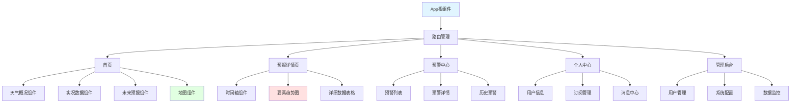

**状态管理（Redux）**：

```javascript
// store/weatherSlice.js
import { createSlice, createAsyncThunk } from '@reduxjs/toolkit';
import axios from 'axios';

// 异步获取预报数据
export const fetchForecast = createAsyncThunk(
  'weather/fetchForecast',
  async ({ location, hours }, { rejectWithValue }) => {
    try {
      const response = await axios.get('/api/v1/weather/forecast', {
        params: { location, hours }
      });
      return response.data.data;
    } catch (error) {
      return rejectWithValue(error.response.data);
    }
  }
);

const weatherSlice = createSlice({
  name: 'weather',
  initialState: {
    currentLocation: null,
    forecast: null,
    loading: false,
    error: null
  },
  reducers: {
    setLocation: (state, action) => {
      state.currentLocation = action.payload;
    },
    clearError: (state) => {
      state.error = null;
    }
  },
  extraReducers: (builder) => {
    builder
      .addCase(fetchForecast.pending, (state) => {
        state.loading = true;
        state.error = null;
      })
      .addCase(fetchForecast.fulfilled, (state, action) => {
        state.loading = false;
        state.forecast = action.payload;
      })
      .addCase(fetchForecast.rejected, (state, action) => {
        state.loading = false;
        state.error = action.payload;
      });
  }
});

export const { setLocation, clearError } = weatherSlice.actions;
export default weatherSlice.reducer;
```

**地图可视化组件**：

```javascript
// components/WeatherMap.jsx
import React, { useEffect, useRef, useState } from 'react';
import L from 'leaflet';
import 'leaflet/dist/leaflet.css';

const WeatherMap = ({ center = [39.9, 116.4], zoom = 10, weatherData }) => {
  const mapRef = useRef(null);
  const [map, setMap] = useState(null);
  const [layers, setLayers] = useState({});

  useEffect(() => {
    // 初始化地图
    const mapInstance = L.map(mapRef.current).setView(center, zoom);
    
    // 添加底图
    L.tileLayer('https://{s}.tile.openstreetmap.org/{z}/{x}/{y}.png', {
      attribution: '© OpenStreetMap contributors'
    }).addTo(mapInstance);
    
    setMap(mapInstance);
    
    return () => {
      mapInstance.remove();
    };
  }, []);

  useEffect(() => {
    if (!map || !weatherData) return;

    // 清除旧图层
    Object.values(layers).forEach(layer => map.removeLayer(layer));

    // 添加温度等值线图层
    if (weatherData.temperature) {
      const temperatureLayer = L.geoJSON(weatherData.temperature, {
        style: (feature) => ({
          color: getTemperatureColor(feature.properties.value),
          weight: 2,
          opacity: 0.6
        })
      }).addTo(map);
      
      setLayers(prev => ({ ...prev, temperature: temperatureLayer }));
    }

    // 添加降水区域
    if (weatherData.precipitation) {
      const precipitationLayer = L.geoJSON(weatherData.precipitation, {
        style: (feature) => ({
          fillColor: getPrecipitationColor(feature.properties.value),
          fillOpacity: 0.5,
          color: '#000',
          weight: 1
        })
      }).addTo(map);
      
      setLayers(prev => ({ ...prev, precipitation: precipitationLayer }));
    }
  }, [map, weatherData]);

  const getTemperatureColor = (temp) => {
    // 温度颜色映射
    if (temp < 0) return '#0000ff';
    if (temp < 10) return '#00ffff';
    if (temp < 20) return '#00ff00';
    if (temp < 30) return '#ffff00';
    return '#ff0000';
  };

  const getPrecipitationColor = (precip) => {
    // 降水颜色映射
    if (precip < 1) return '#e1f5ff';
    if (precip < 10) return '#90caf9';
    if (precip < 25) return '#42a5f5';
    if (precip < 50) return '#1976d2';
    return '#0d47a1';
  };

  return (
    <div 
      ref={mapRef} 
      style={{ height: '600px', width: '100%' }}
      className="weather-map"
    />
  );
};

export default WeatherMap;
```

---

## 7. 软件实现与综合测试

### 7.1 开发环境搭建

#### 7.1.1 开发工具配置

**必需软件清单**：

| 软件/工具 | 版本 | 用途 |
|----------|------|------|
| Python | 3.9+ | 后端开发、算法实现 |
| Node.js | 16.x+ | 前端开发 |
| Docker | 20.10+ | 容器化部署 |
| PostgreSQL | 13+ | 关系数据库 |
| Redis | 6.2+ | 缓存 |
| Kafka | 2.8+ | 消息队列 |
| InfluxDB | 2.x | 时序数据库 |

**开发环境初始化脚本**：

```bash
#!/bin/bash
# setup_dev_env.sh

echo "Setting up development environment..."

# 1. 创建Python虚拟环境
python3 -m venv venv
source venv/bin/activate

# 2. 安装Python依赖
pip install --upgrade pip
pip install -r requirements.txt

# 3. 安装前端依赖
cd frontend
npm install
cd ..

# 4. 启动Docker容器（数据库、消息队列等）
docker-compose up -d

# 5. 等待服务启动
echo "Waiting for services to start..."
sleep 10

# 6. 初始化数据库
python scripts/init_database.py

echo "Development environment setup complete!"
```

### 7.2 核心功能实现

#### 7.2.1 API接口实现

**Flask RESTful API示例**：

```python
from flask import Flask, request, jsonify
from flask_cors import CORS
from datetime import datetime
import logging

app = Flask(__name__)
CORS(app)

# 配置日志
logging.basicConfig(level=logging.INFO)
logger = logging.getLogger(__name__)

@app.route('/api/v1/weather/forecast', methods=['GET'])
def get_forecast():
    """获取天气预报"""
    try:
        # 获取请求参数
        location = request.args.get('location')
        hours = int(request.args.get('hours', 24))
        elements = request.args.getlist('elements') or ['temperature', 'humidity', 'wind']
        
        # 参数验证
        if not location:
            return jsonify({
                'code': 400,
                'message': 'Missing required parameter: location'
            }), 400
        
        if hours < 1 or hours > 168:
            return jsonify({
                'code': 400,
                'message': 'Invalid hours parameter (must be between 1 and 168)'
            }), 400
        
        # 调用预报服务
        forecast_service = ForecastService()
        forecast_result = forecast_service.generate_forecast(
            location=location,
            hours=hours,
            elements=elements
        )
        
        # 返回结果
        return jsonify({
            'code': 200,
            'message': 'success',
            'data': forecast_result
        }), 200
        
    except Exception as e:
        logger.error(f"Forecast API error: {e}")
        return jsonify({
            'code': 500,
            'message': f'Internal server error: {str(e)}'
        }), 500


@app.route('/api/v1/weather/warnings', methods=['GET'])
def get_warnings():
    """获取当前有效预警"""
    try:
        # 可选参数：地区、预警类型
        region = request.args.get('region')
        warning_type = request.args.get('type')
        
        warning_service = WarningService()
        warnings = warning_service.get_active_warnings(
            region=region,
            warning_type=warning_type
        )
        
        return jsonify({
            'code': 200,
            'message': 'success',
            'data': {
                'count': len(warnings),
                'warnings': warnings
            }
        }), 200
        
    except Exception as e:
        logger.error(f"Warnings API error: {e}")
        return jsonify({
            'code': 500,
            'message': f'Internal server error: {str(e)}'
        }), 500


@app.route('/api/v1/user/subscribe', methods=['POST'])
def subscribe_location():
    """订阅位置"""
    try:
        # 获取请求体
        data = request.get_json()
        
        user_id = data.get('user_id')
        location = data.get('location')
        elements = data.get('elements', [])
        
        if not user_id or not location:
            return jsonify({
                'code': 400,
                'message': 'Missing required fields'
            }), 400
        
        # 调用用户服务
        user_service = UserService()
        subscription = user_service.create_subscription(
            user_id=user_id,
            location=location,
            elements=elements
        )
        
        return jsonify({
            'code': 200,
            'message': 'Subscription created successfully',
            'data': subscription
        }), 201
        
    except Exception as e:
        logger.error(f"Subscribe API error: {e}")
        return jsonify({
            'code': 500,
            'message': f'Internal server error: {str(e)}'
        }), 500


if __name__ == '__main__':
    app.run(host='0.0.0.0', port=8080, debug=True)
```

#### 7.2.2 前端页面实现

**天气预报展示页面**：

```jsx
// pages/ForecastPage.jsx
import React, { useEffect, useState } from 'react';
import { useSelector, useDispatch } from 'react-redux';
import { fetchForecast } from '../store/weatherSlice';
import { Card, Spin, Alert, Tabs, Row, Col } from 'antd';
import WeatherMap from '../components/WeatherMap';
import TrendChart from '../components/TrendChart';
import ForecastTable from '../components/ForecastTable';

const { TabPane } = Tabs;

const ForecastPage = () => {
  const dispatch = useDispatch();
  const { currentLocation, forecast, loading, error } = useSelector(state => state.weather);
  const [activeTab, setActiveTab] = useState('overview');

  useEffect(() => {
    if (currentLocation) {
      dispatch(fetchForecast({ 
        location: currentLocation, 
        hours: 72 
      }));
    }
  }, [currentLocation, dispatch]);

  if (loading) {
    return (
      <div style={{ textAlign: 'center', padding: '50px' }}>
        <Spin size="large" tip="正在获取预报数据..." />
      </div>
    );
  }

  if (error) {
    return (
      <div style={{ padding: '20px' }}>
        <Alert
          message="获取预报失败"
          description={error.message || '请稍后重试'}
          type="error"
          showIcon
        />
      </div>
    );
  }

  if (!forecast) {
    return (
      <div style={{ padding: '20px' }}>
        <Alert
          message="请选择位置"
          description="请在搜索框中输入城市或地点名称"
          type="info"
          showIcon
        />
      </div>
    );
  }

  return (
    <div className="forecast-page" style={{ padding: '20px' }}>
      <Card title={`${forecast.location.name} 天气预报`} style={{ marginBottom: '20px' }}>
        <Row gutter={16}>
          <Col span={12}>
            <div className="current-weather">
              <h2>{forecast.current.temperature}°C</h2>
              <p>{forecast.current.weather}</p>
              <p>湿度: {forecast.current.humidity}%</p>
              <p>风速: {forecast.current.wind_speed} m/s</p>
            </div>
          </Col>
          <Col span={12}>
            <div className="weather-icon">
              {/* 天气图标 */}
            </div>
          </Col>
        </Row>
      </Card>

      <Tabs activeKey={activeTab} onChange={setActiveTab}>
        <TabPane tab="概况" key="overview">
          <Card>
            <ForecastTable data={forecast.forecast.slice(0, 7)} />
          </Card>
        </TabPane>

        <TabPane tab="趋势图" key="trend">
          <Card>
            <TrendChart data={forecast.forecast} />
          </Card>
        </TabPane>

        <TabPane tab="地图" key="map">
          <Card>
            <WeatherMap 
              center={[forecast.location.lat, forecast.location.lon]}
              weatherData={forecast.map_data}
            />
          </Card>
        </TabPane>

        <TabPane tab="详细数据" key="details">
          <Card>
            <ForecastTable data={forecast.forecast} detailed={true} />
          </Card>
        </TabPane>
      </Tabs>
    </div>
  );
};

export default ForecastPage;
```

### 7.3 测试策略

#### 7.3.1 单元测试

**Python单元测试示例**：

```python
import unittest
import numpy as np
from datetime import datetime
from data_quality_controller import DataQualityController

class TestDataQualityController(unittest.TestCase):
    """数据质量控制器单元测试"""
    
    def setUp(self):
        """测试初始化"""
        self.qc = DataQualityController(config={})
    
    def test_range_check_valid_data(self):
        """测试范围检查 - 有效数据"""
        data = {
            'timestamp': datetime.now(),
            'location': {'lat': 39.9, 'lon': 116.4},
            'elements': {
                'temperature': 25.5,
                'humidity': 60,
                'pressure': 1013.2
            }
        }
        
        passed, errors = self.qc.range_check(data)
        self.assertTrue(passed)
        self.assertEqual(len(errors), 0)
    
    def test_range_check_invalid_temperature(self):
        """测试范围检查 - 无效温度"""
        data = {
            'timestamp': datetime.now(),
            'location': {'lat': 39.9, 'lon': 116.4},
            'elements': {
                'temperature': 100,  # 异常高温
                'humidity': 60
            }
        }
        
        passed, errors = self.qc.range_check